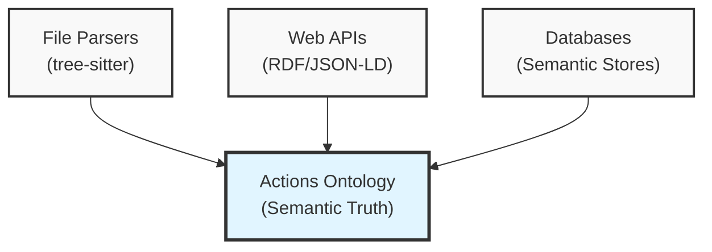

# Actions Vocabulary - Development Guide

## Context

This is a higher order repo with several other repositories as git submodules.

For a large intro please see [the README](./README.md)

### Repository Structure

This repository uses a **versioned layout** (v4 current, v3 legacy):

```mermaid
graph TB
    root["/"]

    subgraph v4["V4 ONTOLOGY (current)"]
        v4_owl["v4/actions-vocabulary.owl<br/>(Minimal CCO extension - OWL/XML)"]
        v4_shapes["v4/actions-shapes-v4.ttl<br/>(SHACL validation)"]
    end

    subgraph v3["V3.1.0 ONTOLOGY (legacy)"]
        owl["actions-vocabulary.owl<br/>(Complete v3.1.0 ontology - OWL/XML)<br/>Includes: Core + Context + Workflow + Roles"]
        imports["imports/<br/>(BFO/CCO ontologies)"]
        imports_bfo["bfo.owl"]
        imports_cco_event["cco-event.owl"]
        imports_cco_info["cco-information.owl"]
        tests["tests/<br/>(Validation tests)"]
        test_poc["test_poc.py"]
        bfo_doc["BFO_CCO_ALIGNMENT.md<br/>(v3 architecture docs)"]
        schema_doc["SCHEMA_ORG_ALIGNMENT.md"]
        phase2_design["PHASE2_DESIGN.md<br/>(Extension design rationale)"]
        phase2_impl["PHASE2_IMPLEMENTATION.md<br/>(Implementation details)"]
    end

    subgraph shared["SHARED RESOURCES"]
        docs["docs/"]
        examples["examples/"]
        scripts["scripts/<br/>(Shared tooling)"]
        deployment["DEPLOYMENT.md<br/>(Deployment guide)"]
    end

    subgraph v2["V2 LEGACY"]
        v2_dir["v2/<br/>(Legacy v2 ontology)"]
        v2_vocab["actions-vocabulary.ttl"]
        v2_shapes["actions-shapes.ttl"]
        v2_tests["tests/<br/>(v2 test suite)"]
    end

    subgraph backups["BACKUPS"]
        backup_modular["ontology-backup-modular/<br/>(Previous modular v3.0.0-poc structure)"]
    end

    migrations["migrations/<br/>(Version migration docs)"]
    migration_doc["V2_TO_V3_MIGRATION.md"]

    root --> v4_owl
    root --> v4_shapes
    root --> owl
    root --> imports
    imports --> imports_bfo
    imports --> imports_cco_event
    imports --> imports_cco_info
    root --> tests
    tests --> test_poc
    root --> bfo_doc
    root --> schema_doc
    root --> phase2_design
    root --> phase2_impl
    root --> docs
    root --> examples
    root --> scripts
    root --> deployment
    root --> v2_dir
    v2_dir --> v2_vocab
    v2_dir --> v2_shapes
    v2_dir --> v2_tests
    root --> backup_modular
    root --> migrations
    migrations --> migration_doc
```



## Version Status

**CURRENT: V4** (Minimal CCO extension)
- **Location:** `v4/` directory (`v4/actions-vocabulary.owl` + `v4/actions-shapes-v4.ttl`)
- **Status:** ✅ **CURRENT - USE THIS**
- **Format:** OWL/XML (ontology) + Turtle (SHACL shapes)
- **Architecture:** Minimal extension to CCO
- **Contents:** Core CCO classes + ActPhase
- **Production URL:** 🌐 https://clearhead.us/vocab/actions/v4/
- **Use for:** **ALL NEW DEVELOPMENT**

**LEGACY: V3.1.0** (BFO/CCO-aligned ontology)
- **Location:** Root directory (`actions-vocabulary.owl` + `v3/actions-shapes-v3.ttl`)
- **Status:** ✅ **LEGACY - MAINTAIN ONLY**
- **Format:** OWL/XML (ontology) + Turtle (SHACL shapes)
- **Architecture:** BFO 2.0 + CCO compliant formal ontology
- **Contents:** Consolidated (Core + Context + Workflow + Roles)
- **SHACL Shapes:** Comprehensive validation constraints (456 lines)
- **Production URL:** 🌐 https://clearhead.us/vocab/actions/v3/

**What's Complete:**
- ✅ V4 Ontology: Minimal CCO-aligned semantic model
- ✅ V4 SHACL Shapes: Core validation constraints
- ✅ V3 Ontology + Shapes: Stable legacy reference
- ✅ Production Deployment: Live at clearhead.us with content negotiation
- ✅ Cloudflare Infrastructure: Pages + Worker for semantic web compliance

**ARCHIVED: v2** (Schema.org-based, superseded)
- **Location:** `v2/` directory
- **Status:** Archived, stable but not for new development
- **Format:** Turtle (TTL)
- **Use only for:** Reference or legacy integrations

See [README.md](../README.md) for current architecture and [migrations/V3_TO_V4_MIGRATION.md](./migrations/V3_TO_V4_MIGRATION.md) for migration guide.

## How It Is Used

The vocabulary is primarily imported into Protégé ontology editor to get the structure right.

We also use code editors (neovim/VSCode) to edit the ontology by hand for structured edits.

**For v4:** OWL/XML format is preferred for Protégé compatibility and industry standards.

## Testing

### v3.1.0 Tests (Legacy)
```bash
# Run v3.1.0 validation (consolidated ontology)
uv run pytest

# Run with verbose output to see details
uv run pytest -v

# Run only unit tests (skip slow reasoning tests)
uv run pytest -m "not slow"

# Expected results:
# ✅ 12 classes loaded (core + extensions)
# ✅ 20 properties defined (core + extensions)
# ✅ Logically consistent (HermiT reasoner)
# ✅ ~260 RDF triples
```

### v2 Tests (Legacy)
```bash
cd v2
uv run pytest
```

Check `pyproject.toml` for additional commands.

## v3 Architecture Principles (Legacy)

### Semantic Web Design Philosophy

#### BFO First, Schema.org Second
- **Primary alignment:** BFO/CCO for formal rigor
- **Secondary alignment:** SKOS mapping to Schema.org for web benefits
- **Continuant vs Occurrent:** Separate information (plans) from processes (executions)
- **Reuse CCO Patterns:** Extend proven CCO patterns (Plan, IntentionalAct) before creating custom classes
- **SKOS for Cross-Ontology:** Use `skos:closeMatch` for Schema.org alignment, not `rdfs:subClassOf`
- **Document Decisions:** Record architectural decisions in dedicated markdown files

See [BFO_CCO_ALIGNMENT.md](./BFO_CCO_ALIGNMENT.md) for detailed technical mapping.

### OWL vs SHACL Boundaries 

**OWL Responsibilities (Logical Domain Model)**
- Class hierarchy and relationships - what CAN exist
- Disjointness declarations - mutually exclusive classes
- Domain/range restrictions - semantic constraints
- Functional properties - single-valued properties
- Schema.org alignment via SKOS

**SHACL Responsibilities (Data Quality Validation)**
- Required fields and cardinality - what MUST exist
- Value constraints - ranges, patterns, formats
- Business rules - complex validation via SPARQL
- Non-functional cardinality
- Temporal logic

**Key Rule:** Avoid Redundancy
- Don't duplicate `owl:FunctionalProperty` with `sh:maxCount 1`
- Let OWL handle logical constraints, let SHACL handle data validation

### Testing Strategy

**Current:**
1. Pytest test suite (`tests/test_poc.py`) - Automated validation with fixtures
2. Protégé + HermiT reasoner validation - Manual visual verification

**Test Organization:**
1. **OWL Reasoning Tests** (Unit) - Ontology satisfiability, class disjointness, property correctness
2. **SHACL Validation Tests** (Validation) - Data quality constraints, business rules
3. **Integration Tests** (Slow) - HermiT reasoner consistency checking

## "Small Waist" Architecture

This ontology serves as the **minimal stable interface** between different implementations:



**Benefits:**
- **Code Generation:** Types and validators generated from ontology + SHACL
- **Interoperability:** Consistent RDF data exchange between implementations
- **Testing:** Unified SHACL validation across all tools
- **Evolution:** Backward-compatible extensions via OWL reasoning

## Key Files

### v4 Files (Current)
- **v4/actions-vocabulary.owl** - Minimal CCO extension (OWL/XML)
- **v4/actions-shapes-v4.ttl** - SHACL validation constraints
- **V4_DESIGN.md** - v4 design rationale
- **V4_DESIGN_EXPLORATION.md** - v4 design alternatives
- **V4_TRANSITION_STATUS.md** - v4 transition status

### v3.1.0 Files (Legacy at Root)
- **README.md** - Project overview and quick start
- **CLAUDE.md** - This file (development guide for AI & humans)
- **actions-vocabulary.owl** - Consolidated v3.1.0 ontology (OWL/XML)
  - Includes: Core + Context + Workflow + Roles (all integrated)
- **v3/actions-shapes-v3.ttl** - SHACL validation constraints
- **BFO_CCO_ALIGNMENT.md** - Technical BFO/CCO mapping
- **SCHEMA_ORG_ALIGNMENT.md** - Schema.org vocabulary alignment via SKOS
- **PHASE2_DESIGN.md** - Extension design rationale
- **PHASE2_IMPLEMENTATION.md** - Extension implementation details
- **DEPLOYMENT.md** - Vocabulary hosting and deployment guide (Cloudflare)
- **tests/test_poc.py** - Test suite (pytest)
- **imports/** - BFO and CCO ontology files

### Deployment Files
- **wrangler.jsonc** - Cloudflare Pages configuration
- **site/** - Built static site for deployment
  - **site/_headers** - HTTP headers and CORS configuration
  - **site/_redirects** - URL redirects and basic content negotiation
  - **site/vocab/actions/v3/** - All vocabulary formats (OWL, TTL, JSON-LD, RDF)
- **workers/content-negotiation/** - Cloudflare Worker for semantic web content negotiation
  - **worker.js** - Content negotiation logic (Accept header routing)
  - **wrangler.jsonc** - Worker configuration
  - **README.md** - Worker deployment guide
- **tasks.py** - Invoke tasks for building, testing, and deployment

### Shared Files
- **docs/** - Additional documentation
- **examples/** - Example data

### Archived Files
- **ontology-backup-modular/** - Previous v3.0.0-poc modular structure
  - actions-vocabulary.owl (core only)
  - actions-context.owl
  - actions-roles.owl
  - actions-workflow.owl

### v2 Files (Legacy in v2/ directory)
- **v2/README.md** - v2 concepts and usage
- **v2/CLAUDE.md** - v2 development guide
- **v2/ONTOLOGY.md** - v2 semantic documentation
- **v2/actions-vocabulary.ttl** - v2 ontology
- **v2/actions-shapes.ttl** - v2 SHACL constraints
- **v2/tests/** - v2 test suite

## Which Version to Work On?

**Work on v4 (v4/ directory) for:**
- All new development
- Interoperability-first integrations
- Production deployments
- New projects and features

**Work on v3.1.0 (root) only if:**
- Maintaining existing v3 deployments
- Supporting legacy integrations
- You need the full workflow/context/roles extensions

**Work on v2 (v2/ directory) only if:**
- Maintaining existing v2 deployments
- Supporting legacy integrations
- Cannot migrate to v3 yet

## Common Pitfalls for Future Development

### 🚫 Avoid These Mistakes

1. **Mixing upper ontologies** - Don't use both `rdfs:subClassOf cco:ont00000965` and `rdfs:subClassOf schema:Action`
2. **State on plans** - Plans don't have state, processes do
3. **Forgetting reasoner validation** - Always run HermiT after OWL changes
4. **Unclear property names** - Use `hasDoDate`, not just `date`
5. **Missing namespace declarations** - Always declare prefixes
6. **Using non-existent CCO classes** - CCO doesn't have a `Plan` class; use `DirectiveInformationContentEntity` (ont00000965)

### ✅ Follow These Patterns

1. **Use SKOS for Schema.org alignment** - `skos:closeMatch schema:Action`, not `rdfs:subClassOf`
2. **Separate plans from processes** - Information vs occurrents
3. **Test both layers** - Syntax validation + reasoning
4. **Update documentation** - Always sync markdown files with changes
5. **Validate frequently** - `uv run pytest`

## Integration Guidelines

### For Future AI Assistants

- **Always read documentation first** - README.md, BFO_CCO_ALIGNMENT.md, SCHEMA_ORG_ALIGNMENT.md
- **Understand version structure** - Root = v3, v2/ = legacy
- **Check existing tests** before making changes
- **Run validation after modifications** - Python tests + HermiT reasoner
- **Consider BFO/CCO alignment** for any new classes/properties
- **Use SKOS for Schema.org** - Not class hierarchy mixing

### For Human Developers

- **Use Protégé for visual exploration** of the ontology structure
- **Start with documentation** - BFO_CCO_ALIGNMENT.md explains design decisions
- **Leverage testing framework** to validate changes
- **Reference v2 for comparison** - See how concepts evolved
- **Join BFO/CCO community** for broader context

## Common Tasks

### Validate Ontologies
```bash
# Validate v3 + v4 OWL and SHACL syntax
uv run invoke validate

# Run legacy v3 tests
uv run pytest
```

### Edit v4 Ontology
```bash
# Option 1: Protégé (recommended)
# - Open v4/actions-vocabulary.owl
# - Make changes visually
# - Run HermiT reasoner to check consistency
# - Save
# - Run: uv run pytest

# Option 2: Direct OWL/XML editing
# - Edit v4/actions-vocabulary.owl (use your editor)
# - Validate: uv run invoke validate
# - Check reasoning in Protégé if making structural changes
```

### Work on v2 (Legacy - rarely needed)
```bash
cd v2
# Edit actions-vocabulary.ttl or actions-shapes.ttl
uv run pytest
```

### Deploy to Production (Cloudflare)
```bash
# 1. Build the site with all vocabulary formats
uv run invoke build-site

# 2. Deploy to Cloudflare Pages
wrangler pages deploy site --project-name actions-vocabulary --branch main

# 3. Update Worker (if content negotiation logic changed)
cd workers/content-negotiation
wrangler deploy
cd ../..

# Production URLs after deployment:
# - Main: https://clearhead.us/vocab/actions/v3/
# - v4: https://clearhead.us/vocab/actions/v4/
# - v3: https://clearhead.us/vocab/actions/v3/
```

See [DEPLOYMENT.md](./DEPLOYMENT.md) for complete deployment guide, including:
- Custom domain configuration
- Content negotiation Worker setup
- Testing content negotiation
- Troubleshooting

## Decision History & Rationales

### Why BFO/CCO for v3?
- **Scientific Rigor:** ISO standard ontology framework
- **Interoperability:** 450+ ontologies use BFO as upper ontology
- **Clear Semantics:** Formal distinctions (continuant/occurrent)
- **Long-term Maintainability:** Proven patterns from CCO

### Why Separate Plans from Processes?
- **Recurring Actions:** One plan → multiple executions
- **Reality vs Intention:** Execution can diverge from plan
- **BFO Compliance:** Aligns with continuant/occurrent distinction
- **Clear Semantics:** Information (persistent) vs events (temporal)

### Why SKOS for Schema.org?
- **Avoid Upper Ontology Conflicts:** BFO and Schema.org have different philosophies
- **Preserve Benefits:** Still get SEO/web advantages via SKOS alignment
- **Clean Separation:** Formal semantics (BFO) + pragmatic mapping (Schema.org)

See [SCHEMA_ORG_ALIGNMENT.md](./SCHEMA_ORG_ALIGNMENT.md) for full details.

## Resources

### BFO/CCO Resources
- **BFO Specification:** http://basic-formal-ontology.org/
- **CCO Repository:** https://github.com/CommonCoreOntology/CommonCoreOntologies
- **NCOR Resources:** https://ontology.buffalo.edu/

### Tools
- **Protégé:** https://protege.stanford.edu/
- **owlready2 docs:** https://owlready2.readthedocs.io/
- **SKOS Primer:** https://www.w3.org/TR/skos-primer/

### Our Docs
- [README.md](./README.md) - User guide
- [DEPLOYMENT.md](./DEPLOYMENT.md) - Production deployment guide (Cloudflare)
- [BFO_CCO_ALIGNMENT.md](./BFO_CCO_ALIGNMENT.md) - Technical mapping
- [SCHEMA_ORG_ALIGNMENT.md](./SCHEMA_ORG_ALIGNMENT.md) - Schema.org vocabulary alignment
- [workers/content-negotiation/README.md](./workers/content-negotiation/README.md) - Worker setup
- [migrations/V2_TO_V3_MIGRATION.md](./migrations/V2_TO_V3_MIGRATION.md) - Migration guide
- [v2/ONTOLOGY.md](./v2/ONTOLOGY.md) - v2 semantic documentation

## Production Usage

### Accessing the Published Vocabulary

The Actions Vocabulary v4 is live at **https://clearhead.us/vocab/actions/v4/**

**Import in Protégé:**
```
File → Open from URL → https://clearhead.us/vocab/actions/v4/actions-vocabulary.owl
```

**Import in other ontologies:**
```xml
<owl:Ontology rdf:about="https://example.com/my-ontology">
  <owl:imports rdf:resource="https://clearhead.us/vocab/actions/v4"/>
</owl:Ontology>
```

**Content Negotiation:**
```bash
# Request Turtle format
curl -H "Accept: text/turtle" https://clearhead.us/vocab/actions/v4/

# Request JSON-LD format
curl -H "Accept: application/ld+json" https://clearhead.us/vocab/actions/v4/

# Request OWL/XML (default)
curl https://clearhead.us/vocab/actions/v4/
```

**Direct File Access:**
```bash
# OWL/XML (canonical)
curl https://clearhead.us/vocab/actions/v4/actions-vocabulary.owl

# Turtle (human-readable)
curl https://clearhead.us/vocab/actions/v4/actions-vocabulary.ttl

# JSON-LD (web-friendly)
curl https://clearhead.us/vocab/actions/v4/actions-vocabulary.jsonld

# SHACL Shapes (validation)
curl https://clearhead.us/vocab/actions/v4/shapes.ttl
```

### When to Use Each Format

- **OWL/XML** - Protégé, reasoning tools, formal ontology work
- **Turtle** - Version control, manual editing, human readability
- **JSON-LD** - Web applications, JavaScript, REST APIs
- **RDF/XML** - Legacy RDF tools, compatibility
- **SHACL** - Data validation, quality constraints
