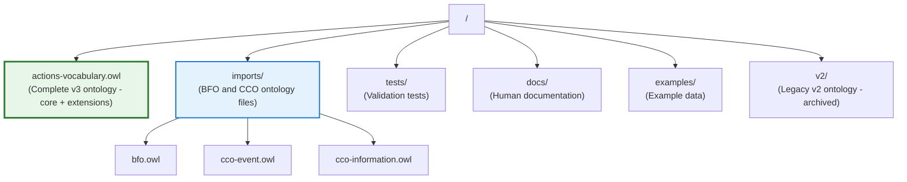
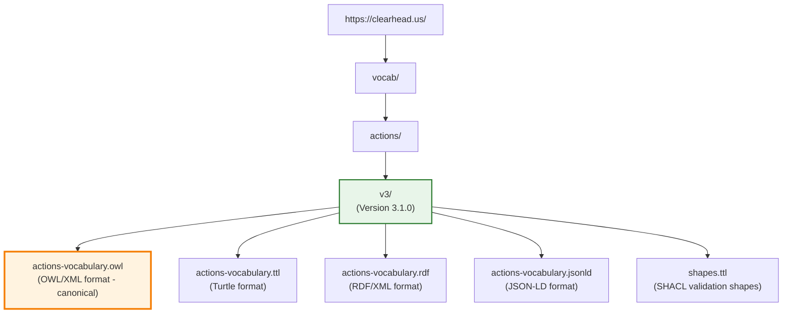

# Vocabulary Deployment Guide

This document explains how to deploy the Actions Vocabulary as a hosted semantic vocabulary with proper content negotiation and discovery.

## 🌐 Production Deployment (Cloudflare)

The Actions Vocabulary v3.1.0 is **live and operational** at **`clearhead.us`**.

✅ **Status:** Production-ready with full semantic web content negotiation
🌐 **URL:** https://clearhead.us/vocab/actions/v3/
📅 **Last Updated:** 2025-11-02
🔒 **SSL:** Automatic HTTPS via Cloudflare

### Current Deployment Status

**Pages Deployment:**
- **Project:** `actions-vocabulary` (Cloudflare Pages)
- **URL:** https://actions-vocabulary.pages.dev
- **Custom Domain:** clearhead.us (configure in Cloudflare dashboard)
- **Build Command:** `uv run invoke build-site`
- **Output Directory:** `site/`

**Content Negotiation Worker:**
- **Worker:** `vocab-content-negotiation`
- **Worker URL:** https://vocab-content-negotiation.darrionburgess.workers.dev
- **Route:** `clearhead.us/vocab/actions/v3*` (configure in dashboard)
- **Function:** Serves different RDF formats based on Accept headers

### Access URLs

**With Content Negotiation (via Worker):**
```bash
# Turtle format
curl -H "Accept: text/turtle" https://clearhead.us/vocab/actions/v3/

# JSON-LD format
curl -H "Accept: application/ld+json" https://clearhead.us/vocab/actions/v3/

# OWL/XML format (default)
curl -H "Accept: application/rdf+xml" https://clearhead.us/vocab/actions/v3/
curl https://clearhead.us/vocab/actions/v3/

# HTML documentation (browser)
open https://clearhead.us/vocab/actions/v3/
```

**Direct File Access (always works):**
- OWL/XML: `https://clearhead.us/vocab/actions/v3/actions-vocabulary.owl`
- Turtle: `https://clearhead.us/vocab/actions/v3/actions-vocabulary.ttl`
- JSON-LD: `https://clearhead.us/vocab/actions/v3/actions-vocabulary.jsonld`
- RDF/XML: `https://clearhead.us/vocab/actions/v3/actions-vocabulary.rdf`
- SHACL Shapes: `https://clearhead.us/vocab/actions/v3/shapes.ttl`

### Deploying Updates

**1. Update Pages Deployment:**
```bash
# Build the site
uv run invoke build-site

# Deploy to Cloudflare Pages
wrangler pages deploy site --project-name actions-vocabulary --branch main
```

**2. Update Content Negotiation Worker (if needed):**
```bash
cd workers/content-negotiation
wrangler deploy
```

See [workers/content-negotiation/README.md](./workers/content-negotiation/README.md) for Worker setup details.

### Custom Domain Configuration

**To configure `clearhead.us` custom domain:**

1. **Add Custom Domain to Pages Project:**
   - Go to: Cloudflare Dashboard → Pages → `actions-vocabulary` project
   - Click **"Custom domains"** tab
   - Click **"Set up a custom domain"**
   - Enter: `clearhead.us`
   - Cloudflare will auto-configure DNS if domain is in your account
   - Wait for SSL certificate to provision (usually < 1 minute)

2. **Configure Worker Route:**
   - Go to: Cloudflare Dashboard → Workers & Pages → `vocab-content-negotiation`
   - Click **"Triggers"** tab → **"Routes"** → **"Add route"**
   - **Route pattern:** `clearhead.us/vocab/actions/v3*`
   - **Zone:** clearhead.us
   - **Worker:** vocab-content-negotiation
   - Click **"Add route"**

Once configured, content negotiation will work on the custom domain.

## 🎯 Quick Start

The Actions Vocabulary v3 is now consolidated into a single OWL file for easier deployment and use.

### Build and Test Locally

```bash
cd ontology

# Install dependencies
uv sync

# Validate the ontology
uv run pytest

# Build the complete site (if needed for web hosting)
uv run invoke build-site

# Serve locally for testing
uv run invoke serve-local
```

## 📁 Current Structure

The v3 ontology is now **consolidated** for simplicity:



### What's Included in actions-vocabulary.owl

The consolidated ontology includes:

**Core Classes:**
- ActionPlan, ActionProcess
- RootActionPlan, ChildActionPlan, LeafActionPlan
- ActionState (NotStarted, InProgress, Completed, Blocked, Cancelled)

**Context Extension:**
- ActionContext, LocationContext, ToolContext, EnergyContext, SocialContext
- requiresContext, requiresFacility, requiresArtifact, requiresAgent

**Workflow Extension:**
- Milestone class
- dependsOn, cannotStartUntil, mustCompleteBefore, preferredAfter
- blockedBy, canRunInParallel

**Role Integration:**
- assignedToAgent, performedBy, delegatedBy, inRoleContext
- Integration with CCO Agent and Role infrastructure

## 🚀 Hosting Options

### Option 1: GitHub Pages (Recommended for Simple Hosting)

```bash
# In your repository
mkdir -p docs/actions/v3
cp actions-vocabulary.owl docs/actions/v3/

# Commit and push
git add docs/
git commit -m "Add consolidated v3 ontology"
git push

# Enable GitHub Pages in repository settings
# Set source to "docs" folder
```

**Access URL:**
```
https://[username].github.io/[repo]/actions/v3/actions-vocabulary.owl
```

### Option 2: Custom Domain with Content Negotiation

For production deployments with w3id.org or custom domains:

**URI Strategy (Production at clearhead.us):**


**Note:** This is the current production deployment. See "Production Deployment" section above for details.

**Content Negotiation (.htaccess example):**
```apache
# Serve appropriate format based on Accept header
RewriteEngine On
RewriteBase /actions/v3/

# OWL/XML (default)
RewriteCond %{HTTP_ACCEPT} application/rdf\+xml [NC,OR]
RewriteCond %{HTTP_ACCEPT} application/xml [NC]
RewriteRule ^$ actions-vocabulary.owl [L]

# Turtle
RewriteCond %{HTTP_ACCEPT} text/turtle [NC]
RewriteRule ^$ actions-vocabulary.ttl [L]

# JSON-LD
RewriteCond %{HTTP_ACCEPT} application/ld\+json [NC]
RewriteRule ^$ actions-vocabulary.jsonld [L]

# Default to OWL
RewriteRule ^$ actions-vocabulary.owl [L]
```

### Option 3: w3id.org Permanent Identifier

For permanent, community-maintained URIs:

1. Fork https://github.com/perma-id/w3id.org
2. Create `.htaccess` in `/actions/`:
   ```apache
   # Redirect to your hosted vocabulary
   RewriteRule ^v3$ https://clearhead.us/vocab/actions/v3/ [R=302,L]
   ```
3. Submit pull request to w3id.org
4. Once merged, use `https://w3id.org/actions/v3` in your ontologies

**Note:** Currently using `clearhead.us` directly. Consider w3id.org for long-term persistence and community trust.

## 🔍 Content Negotiation Testing

Test that your deployment serves the correct format:

```bash
# Request OWL/XML
curl -H "Accept: application/rdf+xml" https://clearhead.us/vocab/actions/v3/

# Request Turtle
curl -H "Accept: text/turtle" https://clearhead.us/vocab/actions/v3/

# Request JSON-LD
curl -H "Accept: application/ld+json" https://clearhead.us/vocab/actions/v3/

# No Accept header (should default to OWL/XML)
curl https://clearhead.us/vocab/actions/v3/

# Verify correct Content-Type in response
curl -I -H "Accept: text/turtle" https://clearhead.us/vocab/actions/v3/
```

**Expected Behavior:**
- Turtle request → Returns Turtle format, starts with `@prefix`
- JSON-LD request → Returns JSON-LD format, starts with `[` or `{`
- OWL/XML request → Returns OWL/XML format, starts with `<?xml`
- Browser (HTML) → Returns HTML documentation page

## 📦 Generating Alternative Formats

If you need to generate TTL, RDF/XML, or JSON-LD formats from the OWL file:

```bash
# Using rdflib (Python)
uv run python -c "
from rdflib import Graph

g = Graph()
g.parse('actions-vocabulary.owl', format='xml')

# Generate Turtle
g.serialize('actions-vocabulary.ttl', format='turtle')

# Generate RDF/XML
g.serialize('actions-vocabulary.rdf', format='pretty-xml')

# Generate JSON-LD
g.serialize('actions-vocabulary.jsonld', format='json-ld')
"
```

## 🔗 Using in Protégé

**Load from Production URL:**
```
File → Open from URL → https://clearhead.us/vocab/actions/v3/actions-vocabulary.owl
```

**For Offline Development (Optional Catalog File):**

Create `catalog-v001.xml` in your project directory:
```xml
<?xml version="1.0" encoding="UTF-8" standalone="no"?>
<catalog prefer="public" xmlns="urn:oasis:names:tc:entity:xmlns:xml:catalog">
  <uri name="https://clearhead.us/vocab/actions/v3" uri="actions-vocabulary.owl"/>
</catalog>
```

This allows you to:
- Work offline with a local copy of the ontology
- Reference production URIs (`https://clearhead.us/vocab/actions/v3`) in your ontology files
- Protégé automatically resolves to local files when offline
- Switch to production URL when online without changing imports

## 📝 Importing in Other Ontologies

To use the Actions Vocabulary in your ontology:

```xml
<owl:Ontology rdf:about="https://example.com/my-ontology">
  <!-- Import the consolidated vocabulary from production -->
  <owl:imports rdf:resource="https://clearhead.us/vocab/actions/v3"/>
</owl:Ontology>
```

**What you get:**
- All core classes (ActionPlan, ActionProcess, etc.)
- All extensions (Context, Workflow, Roles)
- Full BFO/CCO alignment
- SHACL shapes available separately at `/vocab/actions/v3/shapes.ttl`

## 🔄 Version Management

### Current Version: 3.1.0

The consolidated ontology includes:
- v3.0.0 core (POC) → INTEGRATED
- v3.1.0 extensions (context, workflow, roles) → INTEGRATED

### Version URIs

```
https://clearhead.us/vocab/actions/v3         # Current version (3.1.0) - PRODUCTION
https://clearhead.us/vocab/actions/v3/3.1.0   # Specific version (future)
https://clearhead.us/vocab/actions/latest     # Always redirects to current (future)
```

**Current Deployment:**
- Version 3.1.0 is served at `/vocab/actions/v3/`
- Version-specific URIs and `/latest` redirect will be added in future updates

**Best Practice:** Use the stable `/v3/` URI for imports. The major version (v3) will remain stable while minor updates are added.

## 🧪 Validation

After deployment, validate your vocabulary:

```bash
# Test loading
uv run pytest

# Test reasoning (requires Protégé or owlready2)
# Open in Protégé → Reasoner → HermiT → Start reasoner
```

**Expected Results:**
- ✅ 12 classes loaded
- ✅ 20 properties defined
- ✅ Logically consistent (no reasoning errors)
- ✅ ~229 RDF triples

## 📚 Additional Resources

### W3C Best Practices
- [Cool URIs for the Semantic Web](https://www.w3.org/TR/cooluris/)
- [Best Practices for Publishing Linked Data](https://www.w3.org/TR/ld-bp/)
- [Content Negotiation by Profile](https://www.w3.org/TR/dx-prof-conneg/)

### Tools
- **Protégé**: https://protege.stanford.edu/
- **RDFLib**: https://rdflib.readthedocs.io/
- **w3id.org**: https://github.com/perma-id/w3id.org

### Documentation
- [README.md](./README.md) - User guide and quick start
- [BFO_CCO_ALIGNMENT.md](./BFO_CCO_ALIGNMENT.md) - Technical BFO/CCO mapping
- [SCHEMA_ORG_ALIGNMENT.md](./SCHEMA_ORG_ALIGNMENT.md) - Schema.org integration
- [CLAUDE.md](./CLAUDE.md) - Development guide

## 🆘 Troubleshooting

### Issue: Ontology won't load in Protégé

**Solution:**
1. Use the direct OWL file URL: `https://clearhead.us/vocab/actions/v3/actions-vocabulary.owl`
2. If using imports, ensure BFO/CCO import statements are uncommented in local file
3. Check that you have import files in the `imports/` directory for offline work

### Issue: Content negotiation not working on Cloudflare

**Diagnosis:**
```bash
# Check if Worker is routing correctly
curl -I -H "Accept: text/turtle" https://clearhead.us/vocab/actions/v3/

# Should return Content-Type: text/turtle
# If not, Worker may not be configured
```

**Solutions:**
1. **Verify Worker Route:** Go to Cloudflare Dashboard → Workers → vocab-content-negotiation → Triggers
   - Ensure route `clearhead.us/vocab/actions/v3*` exists and is active
2. **Check Worker Deployment:** Run `cd workers/content-negotiation && wrangler deploy`
3. **Use Direct URLs:** As fallback, use direct file URLs (always work):
   - `https://clearhead.us/vocab/actions/v3/actions-vocabulary.owl`
   - `https://clearhead.us/vocab/actions/v3/actions-vocabulary.ttl`

### Issue: 404 errors after deployment

**Solution:**
1. Wait 30-60 seconds for Cloudflare Pages to propagate changes
2. Verify build succeeded: Check Cloudflare Dashboard → Pages → actions-vocabulary → Deployments
3. Check that `site/vocab/actions/v3/` directory contains all files:
   ```bash
   ls -la site/vocab/actions/v3/
   ```
4. Redeploy if needed: `wrangler pages deploy site --project-name actions-vocabulary --branch main`

### Issue: DNS not resolving (clearhead.us)

**Solution:**
1. Check custom domain configuration in Cloudflare Dashboard → Pages → Custom domains
2. Verify DNS records are correct (should auto-configure)
3. Wait for DNS propagation (can take up to 24 hours, usually < 5 minutes)
4. Test with Pages URL as fallback: `https://actions-vocabulary.pages.dev/vocab/actions/v3/`

### Issue: Imports fail in other ontologies

**Solution:** Ensure:
1. The vocabulary is hosted at the exact URI used in the import statement
2. Use the OWL/XML direct URL if content negotiation is problematic
3. The server supports CORS (Cloudflare Pages does by default via `_headers` file)
4. Clear browser/Protégé cache if previously loaded a different version

### Issue: Worker shows "Compute server error"

**Diagnosis:** Worker code has a bug or is trying to access unavailable resources

**Solution:**
1. Check Worker logs in Cloudflare Dashboard → Workers → vocab-content-negotiation → Logs
2. Verify `VOCAB_BASE` constant in `workers/content-negotiation/worker.js` is correct
3. Test Worker directly: `https://vocab-content-negotiation.darrionburgess.workers.dev/vocab/actions/v3/`
4. Redeploy Worker: `cd workers/content-negotiation && wrangler deploy`

## 📧 Support

For issues or questions:
- Open an issue on GitHub
- Consult [CLAUDE.md](./CLAUDE.md) for development guidance
- Review [BFO_CCO_ALIGNMENT.md](./BFO_CCO_ALIGNMENT.md) for semantic questions

---

**Last Updated:** 2025-11-02
**Ontology Version:** 3.1.0 (consolidated)
**Production URL:** https://clearhead.us/vocab/actions/v3/
**Status:** ✅ Live and operational
