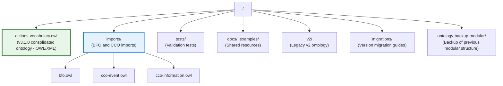

# Actions Vocabulary v3 - BFO/CCO-Aligned Ontology
**Current Version**: 3.1.0 (Production)
**Namespace**: `https://clearhead.us/vocab/actions/v3#`
**Production URL**: 🌐 https://clearhead.us/vocab/actions/v3/
**Status**: ✅ Live and operational with semantic web content negotiation

## What is This?

The Actions Vocabulary provides a **formal semantic foundation** for task management systems, combining:

- **BFO 2.0 Compliance** - ISO standard upper ontology (ISO/IEC 21838-2:2021)
- **CCO Integration** - Common Core Ontologies mid-level framework
- **Schema.org Alignment** - SKOS-mapped for web/SEO benefits

This ontology serves as the **"small waist" architecture** - a minimal, semantically rigorous interface that enables scientific-grade reasoning while supporting practical code generation.

### Version History
- **v3.1.0** (Current) - Consolidated BFO/CCO-aligned ontology
  - Location: Root directory (`actions-vocabulary.owl`)
  - Format: OWL/XML
  - Includes: Core classes + Context + Workflow + Role extensions (all in one file)
  - See: [BFO_CCO_ALIGNMENT.md](./BFO_CCO_ALIGNMENT.md), [SCHEMA_ORG_ALIGNMENT.md](./SCHEMA_ORG_ALIGNMENT.md)

- **v3.0.0-poc** (Archived) - Initial POC with modular extensions
  - Status: Consolidated into v3.1.0
  - Backup: `ontology-backup-modular/`

- **v2** (Legacy) - Schema.org-based pragmatic ontology
  - Location: `v2/` directory
  - Format: Turtle (`.ttl`)
  - See: [v2/README.md](./v2/README.md), [v2/ONTOLOGY.md](./v2/ONTOLOGY.md)
  - Migration guide: [migrations/V2_TO_V3_MIGRATION.md](./migrations/V2_TO_V3_MIGRATION.md)

### Import in Protégé
```
File → Open from URL → https://clearhead.us/vocab/actions/v3/actions-vocabulary.owl
```

### Import in Your Ontology
```xml
<owl:Ontology rdf:about="https://example.com/my-ontology">
  <owl:imports rdf:resource="https://clearhead.us/vocab/actions/v3"/>
</owl:Ontology>
```

### Available Formats
- **OWL/XML** (canonical): `https://clearhead.us/vocab/actions/v3/actions-vocabulary.owl`
- **Turtle**: `https://clearhead.us/vocab/actions/v3/actions-vocabulary.ttl`
- **JSON-LD**: `https://clearhead.us/vocab/actions/v3/actions-vocabulary.jsonld`
- **SHACL Shapes**: `https://clearhead.us/vocab/actions/v3/shapes.ttl`

**Content Negotiation Supported:** Send an `Accept` header to get your preferred format automatically.

See [DEPLOYMENT.md](./DEPLOYMENT.md) for deployment details and [CLAUDE.md](./CLAUDE.md) for usage examples.

## Quick Start (Local Development)

### Prerequisites
```bash
# Python 3.12+ with uv package manager
uv sync
```

### Validation
```bash
# Run v3 validation tests
uv run pytest

# Run with verbose output
uv run pytest -v

# Run only unit tests (skip slow reasoning)
uv run pytest -m "not slow"

# Expected results:
# ✅ 12 classes + 8 annotated BFO/CCO classes
# ✅ 20 properties + 2 annotated CCO properties
# ✅ ~260 RDF triples
# ✅ Logically consistent

# For v2 legacy tests
cd v2 && uv run pytest
```

### Visual Exploration
```bash
# Open in Protégé ontology editor
# File → Open → actions-vocabulary.owl
# Reasoner → HermiT → Start reasoner
```

## Key Architectural Change: Plan vs Process Separation

### v2 Model (Single Entity)
```turtle
:action1 a actions:Action ;
    schema:name "Review reports" ;
    actions:state actions:Completed .
```
❌ **Problem:** Conflates WHAT to do (plan) with HOW it was done (execution)

### v3 Model (Separation of Concerns)
```turtle
# The PLAN (information - what to do)
:review_plan a actions:ActionPlan ;
    schema:name "Review reports" ;
    actions:hasPriority 2 ;
    actions:prescribes :review_process .

# The EXECUTION (process - how it was done)
:review_process a actions:ActionProcess ;
    actions:hasState actions:Completed .
```
✅ **Benefits:**
- Plans can prescribe multiple executions (recurring actions)
- Execution can diverge from plan (reality vs intention)
- Aligns with BFO continuant/occurrent distinction
- Separates information (persistent) from events (temporal)

## Documentation

### Core Documentation
- **[CLAUDE.md](./CLAUDE.md)** - Development guide (AI & human developers)
- **[BFO_CCO_ALIGNMENT.md](./BFO_CCO_ALIGNMENT.md)** - Technical mapping to BFO/CCO
- **[SCHEMA_ORG_ALIGNMENT.md](./SCHEMA_ORG_ALIGNMENT.md)** - Schema.org integration strategy
- **[DEPLOYMENT.md](./DEPLOYMENT.md)** - Vocabulary hosting and deployment guide

### Extension Documentation
- **[PHASE2_DESIGN.md](./PHASE2_DESIGN.md)** - Design rationale for extensions
- **[PHASE2_IMPLEMENTATION.md](./PHASE2_IMPLEMENTATION.md)** - Implementation details

### Shared Resources
- **[docs/](./docs/)** - Additional documentation
- **[examples/](./examples/)** - Example data and integration guides

## Files Structure



### Consolidated Ontology Contents

The `actions-vocabulary.owl` file includes:

**Core (12 classes, 20 properties):**
- ActionPlan/Process hierarchy
- ActionState enumeration
- Context extension (Location, Tool, Energy, Social)
- Workflow extension (dependencies, milestones)
- Role integration (agent assignment, delegation)

**Plus:** Human-readable labels for all BFO/CCO classes (no more cryptic codes like `ont00000965`!)

## Usage

### For Ontology Developers
```bash
# Edit in Protégé (recommended)
# Or edit OWL/XML directly with understanding of the format

# Validate changes
uv run pytest

# Check consistency with HermiT reasoner in Protégé
```

### For Application Developers
```bash
# Load the vocabulary via content negotiation
curl -H "Accept: text/turtle" https://clearhead.us/vocab/actions/v3/
curl -H "Accept: application/ld+json" https://clearhead.us/vocab/actions/v3/

# Validate your data against SHACL shapes using pyshacl
pip install pyshacl
python -c "from pyshacl import validate; ..."

# See examples/v3/ for reference data and validation patterns
```

## Why v3.1.0?

v2 was a **pragmatic Schema.org-based design** that served production needs well. v3 is a **complete architectural redesign** for:

1. **Formal Semantic Rigor** - BFO compliance enables scientific interoperability
2. **Separation of Concerns** - Plans (information) vs Processes (executions)
3. **CCO Patterns** - Reuse proven mid-level ontology patterns
4. **Broader Interoperability** - Join 450+ BFO-based ontologies
5. **Long-term Maintainability** - Clearer semantics, better reasoner support

v3.1.0 **consolidates** the POC and all Phase 2 extensions into a single, production-ready ontology:

- **Simpler deployment** - One file instead of four modular imports
- **Complete feature set** - Core + Context + Workflow + Roles integrated
- **Production ready** - Tested, validated, and documented

See [migrations/V2_TO_V3_MIGRATION.md](./migrations/V2_TO_V3_MIGRATION.md) for detailed rationale and migration path.

## Tooling

### Recommended Tools
- **[Protégé](https://protege.stanford.edu/)** - Visual ontology editor with HermiT reasoner
- **[owlready2](https://owlready2.readthedocs.io/)** - Python library for OWL ontologies
- **[pySHACL](https://github.com/RDFLib/pySHACL)** - SHACL constraint validation (future)
- **Text Editors** - OWL/XML editing with understanding (VS Code, Neovim, etc.)

## Contributing

When making changes:

1. **Read the docs first** - See CLAUDE.md for development guidelines
2. **Understand BFO/CCO** - Review BFO_CCO_ALIGNMENT.md for design patterns
3. **Test thoroughly** - Run validation suite and HermiT reasoner
4. **Document decisions** - Update relevant .md files with architectural choices

## License

See [LICENSE](./LICENSE)

## Support

- Issues: GitHub issue tracker
- Documentation: See [CLAUDE.md](./CLAUDE.md) for comprehensive development guide
- v2 Support: See [v2/README.md](./v2/README.md) for legacy version
