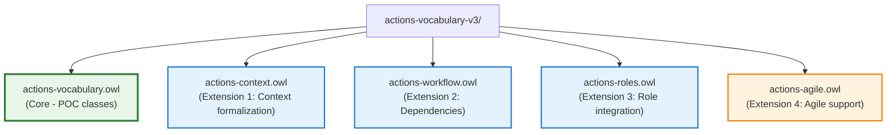

# Actions Vocabulary v3 - Phase 2 Extensions Design

**Author:** Claude (AI Assistant)
**Date:** 2025-10-26
**Status:** ✅ Implemented and Consolidated
**Version:** 3.1.0 (production)

> **Note:** The extensions described in this document have been **consolidated** into the main `actions-vocabulary.owl` file. This document is retained for architectural reference and design rationale.

---

## Executive Summary

This document proposes four modular extensions to the Actions Vocabulary v3 based on a comparative analysis with Common Core Ontologies (CCO) and established productivity frameworks (GTD, Agile). Each extension addresses gaps identified in the current v3 POC while maintaining strict BFO/CCO alignment.

**Extensions Proposed:**
1. **Context Formalization** - Upgrade contexts from string literals to first-class BFO entities
2. **Dependency & Workflow** - Model blocking relationships and sequential constraints
3. **Role Integration** - Connect actions to CCO Agent/Role infrastructure
4. **Agile Module** - Support sprint-based planning and user stories

---

## Table of Contents

1. [Background & Rationale](#background--rationale)
2. [Extension 1: Context Formalization](#extension-1-context-formalization)
3. [Extension 2: Dependency & Workflow](#extension-2-dependency--workflow)
4. [Extension 3: Role Integration](#extension-3-role-integration)
5. [Extension 4: Agile Module](#extension-4-agile-module)
6. [Integration Strategy](#integration-strategy)
7. [Migration Path](#migration-path)
8. [Appendix: Design Alternatives Considered](#appendix-design-alternatives-considered)

---

## Background & Rationale

### Why These Extensions?

After analyzing the CCO merged ontologies (19,756 triples) and reviewing established productivity methodologies, several patterns emerged that the current v3 POC doesn't fully address:

**CCO Capabilities We're Not Leveraging:**
- `cco:Role` (ont00001366) - Over 15 role subtypes for agent responsibilities
- `cco:Facility` (ont00000192) - 47 facility types for location contexts
- `cco:Artifact` (ont00000001) - 200+ artifact types for tool contexts
- `cco:Agent Capability` (ont00001378) - Capability/capacity modeling
- Temporal relations beyond simple timestamps

**GTD/Agile Gaps:**
- **GTD Contexts** are currently strings (`@office`) when they should reference actual entities (Office facility, Computer artifact)
- **Blocked/Waiting** state exists but has no relation to what it's blocked by
- **Areas of Responsibility** not modeled (GTD's roles: Parent, Manager, Health)
- **Sprints** and **User Stories** not formalized (Agile workflows)
- **Dependencies** between tasks not explicitly modeled

### Design Philosophy

**Principle 1: Modularity**
- Each extension is a separate OWL file that can be independently imported
- Core v3 remains stable - extensions are additive only
- Users can import only what they need

**Principle 2: CCO Reuse Over Reinvention**
- If CCO has a pattern, use it rather than creating parallel structures
- Example: Use `cco:Role` instead of creating `actions:AreaOfFocus`
- Reduces maintenance burden and improves interoperability

**Principle 3: Maintain BFO Rigor**
- All new classes must clearly align with BFO categories
- Continuant vs Occurrent distinction preserved
- Relations use BFO object properties or proper CCO extensions

**Principle 4: Backward Compatibility**
- v2 string-based properties remain valid (deprecated but functional)
- Migration path provided for each extension
- SHACL shapes allow gradual adoption

---

## Extension 1: Context Formalization

### Current State (v3 POC)

```turtle
actions:hasContext rdf:type owl:DatatypeProperty ;
  rdfs:domain actions:ActionPlan ;
  rdfs:range xsd:string ;
  rdfs:comment "GTD-style context tag (@phone, @computer, @office)" .

# Usage:
:plan1 actions:hasContext "@office" , "@computer" .
```

**Problems:**
1. ❌ No semantic meaning - can't query "all actions requiring facilities of type Office"
2. ❌ Can't link to actual resources - "Do I have this tool available?"
3. ❌ Typos and inconsistency - "@office" vs "@Office" vs "@work"
4. ❌ Can't reason about resource conflicts or availability
5. ❌ Doesn't leverage CCO's extensive Facility and Artifact hierarchies

### Proposed Design

#### Class Hierarchy

```turtle
actions:ActionContext rdf:type owl:Class ;
  rdfs:subClassOf cco:ont00000965 ;  # DirectiveInformationContentEntity
  rdfs:label "Action Context"@en ;
  skos:definition "A directive information content entity that prescribes environmental, resource, or situational requirements for performing an action."@en ;
  rdfs:comment "Contexts are continuants (information entities) that persist and can be reused across multiple action plans. They prescribe what resources or conditions are needed." .

actions:LocationContext rdf:type owl:Class ;
  rdfs:subClassOf actions:ActionContext ;
  rdfs:label "Location Context"@en ;
  skos:definition "A context specifying that an action requires being performed at a particular type of facility or geospatial location."@en .

actions:ToolContext rdf:type owl:Class ;
  rdfs:subClassOf actions:ActionContext ;
  rdfs:label "Tool Context"@en ;
  skos:definition "A context specifying that an action requires the use of particular artifacts or tools."@en .

actions:EnergyContext rdf:type owl:Class ;
  rdfs:subClassOf actions:ActionContext ;
  rdfs:label "Energy Context"@en ;
  skos:definition "A context specifying the cognitive or physical energy level required to perform an action."@en ;
  rdfs:comment "Based on GTD principle that energy is a limiting resource alongside time and tools." .

actions:SocialContext rdf:type owl:Class ;
  rdfs:subClassOf actions:ActionContext ;
  rdfs:label "Social Context"@en ;
  skos:definition "A context specifying that an action requires the presence or participation of particular agents."@en .
```

#### Object Properties

```turtle
# Core context relation
actions:requiresContext rdf:type owl:ObjectProperty ;
  rdfs:domain actions:ActionPlan ;
  rdfs:range actions:ActionContext ;
  rdfs:label "requires context"@en ;
  rdfs:comment "Links an action plan to the contexts required for its execution. Multiple contexts can be specified." .

# Linking contexts to CCO entities
actions:requiresFacility rdf:type owl:ObjectProperty ;
  rdfs:domain actions:LocationContext ;
  rdfs:range cco:ont00000192 ;  # cco:Facility
  rdfs:label "requires facility"@en ;
  rdfs:comment "Specifies the type of facility needed (Office, Home, Store, etc.)" .

actions:requiresArtifact rdf:type owl:ObjectProperty ;
  rdfs:domain actions:ToolContext ;
  rdfs:range cco:ont00000001 ;  # cco:Artifact
  rdfs:label "requires artifact"@en ;
  rdfs:comment "Specifies artifacts/tools needed (Computer, Phone, Vehicle, etc.)" .

actions:requiresAgent rdf:type owl:ObjectProperty ;
  rdfs:domain actions:SocialContext ;
  rdfs:range cco:ont00000374 ;  # cco:Agent
  rdfs:label "requires agent"@en ;
  rdfs:comment "Specifies other agents whose presence is needed (for meetings, collaborations)." .

# Energy level enumeration
actions:hasEnergyLevel rdf:type owl:DatatypeProperty , owl:FunctionalProperty ;
  rdfs:domain actions:EnergyContext ;
  rdfs:range [ owl:oneOf ( "high" "medium" "low" ) ] ;
  rdfs:label "has energy level"@en .
```

#### Reasoning Benefits

**Query 1: All actions doable at current location**
```sparql
SELECT ?action WHERE {
  ?action actions:requiresContext ?ctx .
  ?ctx a actions:LocationContext ;
       actions:requiresFacility :HomeOffice .
  :me cco:located_in :HomeOffice .
}
```

**Query 2: Actions I can do with low energy**
```sparql
SELECT ?action WHERE {
  ?action actions:requiresContext ?energy_ctx .
  ?energy_ctx a actions:EnergyContext ;
              actions:hasEnergyLevel "low" .
  FILTER NOT EXISTS {
    ?action actions:requiresContext ?other_ctx .
    ?other_ctx a actions:EnergyContext ;
               actions:hasEnergyLevel "high" .
  }
}
```

**Query 3: Resource conflicts**
```sparql
# Find actions requiring the same non-shareable resource at overlapping times
SELECT ?action1 ?action2 ?artifact WHERE {
  ?action1 actions:requiresContext ?ctx1 .
  ?action2 actions:requiresContext ?ctx2 .
  ?ctx1 actions:requiresArtifact ?artifact .
  ?ctx2 actions:requiresArtifact ?artifact .
  ?artifact a cco:ont00001234 .  # Non-shareable artifact type

  ?action1 actions:prescribes ?process1 .
  ?action2 actions:prescribes ?process2 .
  # Temporal overlap check...
  FILTER(?action1 != ?action2)
}
```

### BFO Alignment

**ActionContext as Continuant:**
- ✅ Contexts are **generically dependent continuants** (information entities)
- ✅ They persist through time (a context definition doesn't change)
- ✅ They can be copied and reused (same context applies to multiple actions)
- ✅ They prescribe entities (facilities, artifacts) via CCO's `prescribes` pattern

**Why DirectiveInformationContentEntity?**
- Contexts **prescribe requirements** for action execution
- They are **information** about what is needed (not the physical things themselves)
- Aligns with CCO pattern: Requirements are directives about necessary conditions

### Migration Path

**Backward Compatibility Strategy:**

```turtle
# v2/v3 POC style (deprecated but still works)
:plan1 actions:hasContext "@office" , "@computer" .

# v3.1 style (preferred)
:plan1 actions:requiresContext :office_location_ctx , :computer_tool_ctx .

:office_location_ctx a actions:LocationContext ;
  actions:requiresFacility cco:ont00000XXX .  # Office facility type

:computer_tool_ctx a actions:ToolContext ;
  actions:requiresArtifact cco:ont00000YYY .  # Computer artifact type
```

**Migration Script Logic:**
1. Parse all `actions:hasContext` string values
2. Apply regex patterns to detect type:
   - `@(\w+)` → Create LocationContext or ToolContext based on keyword
   - Common mappings: `@office` → Office facility, `@phone` → Telephone artifact
3. Create context instances with appropriate CCO links
4. Replace string properties with object properties
5. Mark old properties as deprecated in SHACL

**SHACL Constraint (allowing both during transition):**
```turtle
:ActionPlanShape a sh:NodeShape ;
  sh:targetClass actions:ActionPlan ;
  sh:or (
    [ sh:property [ sh:path actions:hasContext ; sh:datatype xsd:string ] ]
    [ sh:property [ sh:path actions:requiresContext ; sh:class actions:ActionContext ] ]
  ) ;
  sh:message "Use requiresContext with ActionContext entities (hasContext string deprecated)" .
```

### Design Alternatives Considered

**Alternative 1: Keep contexts as strings, add validation**
- ❌ Rejected: Doesn't enable semantic reasoning
- ❌ Can't link to CCO resource ontologies
- ❌ Remains brittle and inconsistent

**Alternative 2: Contexts as Qualities (bfo:Quality)**
- ❌ Rejected: Contexts don't inhere in actions
- ❌ Philosophically incorrect - contexts are prescriptive information, not qualities
- ✅ Correct: DirectiveICE prescribes what is needed

**Alternative 3: Contexts as Processes**
- ❌ Rejected: Contexts don't unfold over time
- ❌ They are persistent requirements, not events

**Selected: Contexts as DirectiveInformationContentEntity** ✅
- ✅ Prescribe what is needed for execution
- ✅ Information entities that persist
- ✅ Can be reused across actions
- ✅ Aligns with CCO patterns

---

## Extension 2: Dependency & Workflow

### Current State (v3 POC)

```turtle
actions:Blocked a actions:ActionState ;
  rdfs:label "Blocked"@en ;
  rdfs:comment "Action process is blocked waiting for external dependency." .

# Usage:
:process1 actions:hasState actions:Blocked .
```

**Problems:**
1. ❌ State indicates blocking but doesn't identify what it's blocked by
2. ❌ Can't distinguish "waiting for another action" vs "waiting for external event"
3. ❌ No way to model sequential dependencies ("B starts after A completes")
4. ❌ Can't automatically update state when blocker is resolved
5. ❌ Doesn't support workflow patterns (parallel, sequential, conditional)

### Proposed Design

#### Dependency Relations

```turtle
# Plan-level dependencies (information about execution order)
actions:dependsOn rdf:type owl:ObjectProperty , owl:TransitiveProperty ;
  rdfs:domain actions:ActionPlan ;
  rdfs:range actions:ActionPlan ;
  rdfs:label "depends on"@en ;
  skos:definition "Indicates that this action plan should not begin execution until the target action plan has been completed."@en ;
  rdfs:comment "This is an informational dependency - a prescriptive constraint. The actual blocking occurs at the process level." .

# Process-level blocking (actual execution state)
actions:blockedBy rdf:type owl:ObjectProperty ;
  rdfs:domain actions:ActionProcess ;
  rdfs:range bfo:BFO_0000003 ;  # bfo:Occurrent (any process/event)
  rdfs:label "blocked by"@en ;
  skos:definition "Indicates that this action process cannot continue until the specified occurrent completes."@en ;
  rdfs:comment "More general than dependsOn - can be blocked by any process, not just action processes. Examples: waiting for delivery, waiting for approval, waiting for weather event to pass." .

# Stronger: Must complete before
actions:mustCompleteBefore rdf:type owl:ObjectProperty ;
  rdfs:domain actions:ActionPlan ;
  rdfs:range actions:ActionPlan ;
  rdfs:label "must complete before"@en ;
  owl:inverseOf actions:cannotStartUntil ;
  rdfs:comment "Hard constraint: this action must finish before the target can start. Inverse of cannotStartUntil." .

actions:cannotStartUntil rdf:type owl:ObjectProperty ;
  rdfs:domain actions:ActionPlan ;
  rdfs:range actions:ActionPlan ;
  rdfs:label "cannot start until"@en ;
  owl:inverseOf actions:mustCompleteBefore .

# Weaker: Preferred sequence (not mandatory)
actions:preferredAfter rdf:type owl:ObjectProperty ;
  rdfs:domain actions:ActionPlan ;
  rdfs:range actions:ActionPlan ;
  rdfs:label "preferred after"@en ;
  rdfs:comment "Soft constraint: this action is preferably done after the target, but not required. Used for optimization, not blocking." .
```

#### Workflow Patterns

```turtle
# Parallel execution support
actions:canRunInParallel rdf:type owl:SymmetricProperty ;
  rdfs:domain actions:ActionPlan ;
  rdfs:range actions:ActionPlan ;
  rdfs:label "can run in parallel"@en ;
  rdfs:comment "Indicates these actions have no ordering constraints and can be executed simultaneously." .

# Milestone concept
actions:Milestone rdf:type owl:Class ;
  rdfs:subClassOf actions:ActionPlan ;
  rdfs:label "Milestone"@en ;
  skos:definition "A significant checkpoint or goal in a project, often used as a dependency target for multiple actions."@en ;
  rdfs:comment "Milestones typically have no process - they represent completion of a set of actions." .
```

### Reasoning Rules (SWRL/SPARQL)

**Rule 1: Infer blocked state from dependencies**
```sparql
# CONSTRUCT query to infer blocking
CONSTRUCT {
  ?process actions:hasState actions:Blocked .
  ?process actions:blockedBy ?blocking_process .
} WHERE {
  ?plan actions:prescribes ?process .
  ?plan actions:cannotStartUntil ?dep_plan .
  ?dep_plan actions:prescribes ?blocking_process .

  ?process actions:hasState ?state .
  ?blocking_process actions:hasState ?blocking_state .

  FILTER(?state != actions:Completed)
  FILTER(?blocking_state != actions:Completed)
}
```

**Rule 2: Auto-unblock when dependency completes**
```sparql
# UPDATE query to change state
DELETE { ?process actions:hasState actions:Blocked }
INSERT { ?process actions:hasState actions:NotStarted }
WHERE {
  ?process actions:hasState actions:Blocked .
  ?process actions:blockedBy ?blocking_process .
  ?blocking_process actions:hasState actions:Completed .

  # Check no other blockers remain
  FILTER NOT EXISTS {
    ?process actions:blockedBy ?other_blocker .
    ?other_blocker actions:hasState ?other_state .
    FILTER(?other_blocker != ?blocking_process)
    FILTER(?other_state != actions:Completed)
  }
}
```

**Rule 3: Detect circular dependencies**
```sparql
# Validation query
SELECT ?plan1 ?plan2 WHERE {
  ?plan1 actions:dependsOn+ ?plan2 .
  ?plan2 actions:dependsOn+ ?plan1 .
  FILTER(?plan1 != ?plan2)
}
# If returns results → circular dependency exists
```

### BFO Alignment

**Dependencies as Relations Between Continuants:**
- `actions:dependsOn` relates **plans** (continuants/information)
- This is prescriptive information about execution order
- ✅ Aligns with BFO: Relations between continuants

**Blocking as Relations Between Occurrents:**
- `actions:blockedBy` relates **processes** (occurrents)
- This is actual temporal constraint during execution
- ✅ Aligns with BFO: Processes can temporally precede/block other processes

**Why Two Levels?**
- **Plan level** (`dependsOn`): Information about intended order
- **Process level** (`blockedBy`): Actual execution state at runtime
- Separation allows: Plan A depends on Plan B, but specific process instances may have different blocking relationships

### GTD/Agile Alignment

**GTD "Waiting For" Pattern:**
```turtle
:follow_up_plan a actions:ActionPlan ;
  schema:name "Follow up on proposal" ;
  actions:requiresContext :waiting_for_ctx .

:waiting_for_ctx a actions:SocialContext ;
  actions:requiresAgent :client ;
  rdfs:comment "Waiting for client to review proposal" .

:follow_up_process actions:blockedBy :client_review_process .
```

**Agile Sprint Dependencies:**
```turtle
:sprint2_story1 actions:cannotStartUntil :sprint1_milestone .
:sprint1_milestone a actions:Milestone ;
  schema:name "MVP Release" .
```

### Migration Path

**v3 POC → v3.1:**
```turtle
# v3 POC (state only)
:process1 actions:hasState actions:Blocked .

# v3.1 (state + relation)
:process1 actions:hasState actions:Blocked ;
          actions:blockedBy :process2 .

:plan1 actions:prescribes :process1 ;
       actions:cannotStartUntil :plan2 .
```

**Migration Script:**
1. Identify all processes with `actions:Blocked` state
2. Prompt user to specify what they're blocked by (or infer from plan dependencies)
3. Create `blockedBy` relations
4. For sequential actions in same project, infer `dependsOn` at plan level

**SHACL Validation:**
```turtle
:BlockedProcessShape a sh:NodeShape ;
  sh:targetClass actions:ActionProcess ;
  sh:property [
    sh:path actions:hasState ;
    sh:equals actions:Blocked ;
    sh:implies [ sh:path actions:blockedBy ; sh:minCount 1 ]
  ] ;
  sh:message "Blocked processes should specify what they're blocked by using actions:blockedBy" .
```

### Design Alternatives Considered

**Alternative 1: Single dependency property for both plans and processes**
- ❌ Rejected: Conflates prescriptive (plan) and descriptive (process) information
- ❌ Doesn't align with BFO continuant/occurrent distinction

**Alternative 2: Dependencies as reified objects (n-ary relations)**
```turtle
:dependency1 a actions:Dependency ;
  actions:source :planA ;
  actions:target :planB ;
  actions:dependencyType "must-finish-before" .
```
- ⚠️ Considered: More flexible (can add properties like dependency strength)
- ❌ Rejected for v1: Over-engineering for current use cases
- 💡 Future: Could add if needed for complex project management

**Alternative 3: Use CCO's temporal precedence relations directly**
- `cco:preceded_by` (ont00001803) exists in CCO
- ❌ Rejected: Too general - applies to any occurrents
- ✅ Selected: Create specialized subproperties for clearer semantics

**Selected: Two-level dependency model** ✅
- Plan level: Prescriptive constraints (`dependsOn`, `cannotStartUntil`)
- Process level: Runtime blocking (`blockedBy`)
- Clear BFO alignment, supports both GTD and Agile patterns

---

## Extension 3: Role Integration

### Current State (v3 POC)

**Missing entirely.** No way to:
- Assign actions to people
- Organize actions by life roles (GTD Areas of Focus)
- Track who performed an action
- Filter actions by role context (Work vs Personal vs Health)

### CCO Infrastructure Available

CCO provides extensive agent and role modeling:

```turtle
cco:Agent (ont00000374)
  ├── cco:Person (ont00001337)
  ├── cco:Organization (ont00001269)
  └── cco:Group of Agents (ont00000593)

cco:Role (ont00001366)
  ├── cco:Occupation Role (ont00001097)
  ├── cco:Organization Member Role (ont00000401)
  ├── cco:Allegiance Role (ont00000049)
  └── [15+ other role types]

# Relations
cco:has_agent (ont00001449)
cco:is_performed_by (ont00001489)
cco:has_role (ont00002112)
```

### Proposed Design

#### Reuse CCO Infrastructure

```turtle
# Assignment at plan level (who should do this)
actions:assignedToAgent rdf:type owl:ObjectProperty ;
  rdfs:subPropertyOf cco:ont00001449 ;  # cco:has_agent
  rdfs:domain actions:ActionPlan ;
  rdfs:range cco:ont00000374 ;  # cco:Agent
  rdfs:label "assigned to agent"@en ;
  skos:definition "Specifies which agent is responsible for executing this action plan."@en ;
  rdfs:comment "Prescriptive: indicates who SHOULD perform the action. Actual performer may differ (delegation, reassignment)." .

# Execution at process level (who actually did this)
actions:performedBy rdf:type owl:ObjectProperty ;
  rdfs:subPropertyOf cco:ont00001489 ;  # cco:is_performed_by (or similar)
  rdfs:domain actions:ActionProcess ;
  rdfs:range cco:ont00000374 ;  # cco:Agent
  rdfs:label "performed by"@en ;
  skos:definition "Specifies which agent actually executed this action process."@en ;
  rdfs:comment "Descriptive: records who ACTUALLY performed the action. May differ from assignedToAgent due to delegation." .

# Role context (GTD Areas of Focus)
actions:inRoleContext rdf:type owl:ObjectProperty ;
  rdfs:domain actions:ActionPlan ;
  rdfs:range cco:ont00001366 ;  # cco:Role
  rdfs:label "in role context"@en ;
  skos:definition "Indicates which role or area of responsibility this action belongs to."@en ;
  rdfs:comment "GTD's Areas of Focus: Health, Finance, Career, Family, etc. Use CCO Role types or create domain-specific role instances." .
```

#### GTD Area of Focus Pattern

```turtle
# Define common areas as Role instances
:HealthRole a cco:Role ;
  rdfs:label "Health & Fitness"@en ;
  rdfs:comment "Personal health, fitness, medical care" .

:CareerRole a cco:Role ;
  rdfs:label "Career & Professional Development"@en ;
  rdfs:comment "Job performance, skills, advancement" .

:FinanceRole a cco:Role ;
  rdfs:label "Financial Management"@en ;
  rdfs:comment "Budget, investments, bills, taxes" .

:FamilyRole a cco:Role ;
  rdfs:label "Family & Relationships"@en ;
  rdfs:comment "Spouse, children, extended family" .

:HomeRole a cco:Role ;
  rdfs:label "Home & Property"@en ;
  rdfs:comment "Maintenance, improvements, organization" .

# Usage
:annual_checkup_plan a actions:RootActionPlan ;
  schema:name "Schedule annual physical exam" ;
  actions:inRoleContext :HealthRole ;
  actions:assignedToAgent :me .

:budget_review_plan a actions:RootActionPlan ;
  schema:name "Review monthly budget" ;
  actions:inRoleContext :FinanceRole ;
  actions:assignedToAgent :me .
```

#### Team Collaboration Support

```turtle
# Delegation pattern
:delegate_research_plan a actions:ActionPlan ;
  schema:name "Research competitor products" ;
  actions:assignedToAgent :junior_analyst ;
  actions:delegatedBy :me .

actions:delegatedBy rdf:type owl:ObjectProperty ;
  rdfs:domain actions:ActionPlan ;
  rdfs:range cco:ont00000374 ;  # cco:Agent
  rdfs:label "delegated by"@en ;
  rdfs:comment "Indicates original responsible party who delegated this action." .

# Collaborative actions
:team_meeting_plan a actions:ActionPlan ;
  schema:name "Sprint planning meeting" ;
  actions:requiresContext :team_social_ctx .

:team_social_ctx a actions:SocialContext ;
  actions:requiresAgent :developer1 , :developer2 , :product_owner .
```

### Queries Enabled

**Query 1: My health-related actions**
```sparql
SELECT ?action WHERE {
  ?action actions:inRoleContext :HealthRole ;
          actions:assignedToAgent :me .
}
```

**Query 2: Work-life balance analysis**
```sparql
SELECT ?role (COUNT(?action) as ?count) WHERE {
  ?action actions:assignedToAgent :me ;
          actions:inRoleContext ?role ;
          actions:prescribes ?process .
  ?process actions:hasState actions:Completed .

  # Filter last month
  ?process schema:endTime ?endTime .
  FILTER(?endTime > "2025-09-01"^^xsd:date)
}
GROUP BY ?role
ORDER BY DESC(?count)
```

**Query 3: Delegated tasks pending**
```sparql
SELECT ?action ?assignee WHERE {
  ?action actions:delegatedBy :me ;
          actions:assignedToAgent ?assignee ;
          actions:prescribes ?process .
  ?process actions:hasState ?state .
  FILTER(?state != actions:Completed)
}
```

### BFO Alignment

**Agents as Independent Continuants:**
- ✅ `cco:Agent` extends `bfo:IndependentContinuant`
- Agents exist independently (persons, organizations)
- Proper BFO category for entities that perform actions

**Roles as Realizable Entities:**
- ✅ `cco:Role` extends `bfo:RealizableEntity`
- Roles are realized when agents perform actions in that role
- Proper BFO category for capacities/dispositions

**Relations:**
- `assignedToAgent`: Plan (continuant) → Agent (continuant) ✅
- `performedBy`: Process (occurrent) → Agent (continuant) ✅
- `inRoleContext`: Plan (continuant) → Role (realizable) ✅

All BFO-compliant!

### Migration Path

**v3 POC → v3.1:**
```turtle
# No prior role support, pure addition
# Migration script:
# 1. Prompt user for common Areas of Focus
# 2. Create Role instances
# 3. For each existing action, optionally assign role context
# 4. Assign default agent (user) to unassigned actions
```

**SHACL Recommendations (not requirements):**
```turtle
:ActionPlanRoleShape a sh:NodeShape ;
  sh:targetClass actions:ActionPlan ;
  sh:property [
    sh:path actions:inRoleContext ;
    sh:class cco:Role ;
    sh:maxCount 1 ;
    sh:severity sh:Info ;
    sh:message "Consider assigning actions to Areas of Focus for better organization"
  ] .
```

### Design Alternatives Considered

**Alternative 1: Create custom Area of Focus class**
```turtle
actions:AreaOfFocus rdfs:subClassOf ??? .  # What would this extend?
```
- ❌ Rejected: Duplicates CCO Role functionality
- ❌ Doesn't interoperate with other CCO-based systems
- ❌ Less clear BFO alignment

**Alternative 2: Areas as special Projects**
```turtle
:Health a actions:Project .
```
- ❌ Rejected: Semantically incorrect
- Projects have start/end, produce deliverables
- Areas are ongoing responsibilities with no completion state

**Alternative 3: Use OWL qualified cardinality to require agent**
```turtle
actions:ActionPlan rdfs:subClassOf [
  a owl:Restriction ;
  owl:onProperty actions:assignedToAgent ;
  owl:minCardinality 1
] .
```
- ❌ Rejected: Too strict for personal productivity
- Many actions captured before assignment decided
- Should be recommendation (SHACL info) not hard constraint

**Selected: Direct CCO reuse** ✅
- Use `cco:Agent` for people/organizations
- Use `cco:Role` for Areas of Focus
- Minimal new classes, maximal interoperability
- Clear BFO alignment via CCO

---

## Extension 4: Agile Module

### Current State (v3 POC)

**Missing entirely.** No support for:
- Sprints (time-boxed iterations)
- User Stories (as <role> I want <goal> so that <benefit>)
- Story Points (relative effort estimation)
- Acceptance Criteria
- Velocity tracking
- Backlog prioritization

### Proposed Design

This is the most substantial extension, warranting a separate module file.

#### Sprint Modeling

```turtle
actions-agile:Sprint rdf:type owl:Class ;
  rdfs:subClassOf cco:ont00000159 ;  # cco:Multi-Week Temporal Interval
  rdfs:label "Sprint"@en ;
  skos:definition "A time-boxed iteration period during which a planned set of work is completed."@en ;
  rdfs:comment "Typically 1-4 weeks. Sprints are BFO temporal regions - they are time intervals, not processes." .

actions-agile:hasSprintGoal rdf:type owl:ObjectProperty ;
  rdfs:domain actions-agile:Sprint ;
  rdfs:range cco:ont00000476 ;  # cco:Objective
  rdfs:label "has sprint goal"@en ;
  rdfs:comment "The primary objective this sprint aims to achieve." .

actions-agile:sprintNumber rdf:type owl:DatatypeProperty , owl:FunctionalProperty ;
  rdfs:domain actions-agile:Sprint ;
  rdfs:range xsd:positiveInteger ;
  rdfs:label "sprint number"@en .

actions-agile:sprintVelocity rdf:type owl:DatatypeProperty , owl:FunctionalProperty ;
  rdfs:domain actions-agile:Sprint ;
  rdfs:range xsd:decimal ;
  rdfs:label "sprint velocity"@en ;
  skos:definition "The total story points completed during this sprint."@en ;
  rdfs:comment "Calculated after sprint completion. Used for capacity planning." .
```

#### User Story Modeling

```turtle
actions-agile:UserStory rdf:type owl:Class ;
  rdfs:subClassOf actions:RootActionPlan ;
  rdfs:label "User Story"@en ;
  skos:definition "An action plan expressed from an end-user perspective: As a <role>, I want <goal>, so that <benefit>."@en ;
  rdfs:comment "User stories are a type of action plan. They prescribe work to be done and can be decomposed into tasks (child action plans)." .

actions-agile:asRole rdf:type owl:DatatypeProperty ;
  rdfs:domain actions-agile:UserStory ;
  rdfs:range xsd:string ;
  rdfs:label "as role"@en ;
  rdfs:comment "The user role perspective: 'As a <role>...'" .

actions-agile:iWant rdf:type owl:DatatypeProperty ;
  rdfs:domain actions-agile:UserStory ;
  rdfs:range xsd:string ;
  rdfs:label "I want"@en ;
  rdfs:comment "The desired capability: 'I want <goal>...'" .

actions-agile:soThat rdf:type owl:DatatypeProperty ;
  rdfs:domain actions-agile:UserStory ;
  rdfs:range xsd:string ;
  rdfs:label "so that"@en ;
  rdfs:comment "The business value: 'so that <benefit>.'" .

actions-agile:hasStoryPoints rdf:type owl:DatatypeProperty , owl:FunctionalProperty ;
  rdfs:domain actions-agile:UserStory ;
  rdfs:range xsd:positiveInteger ;
  rdfs:label "has story points"@en ;
  skos:definition "Relative effort estimate using modified Fibonacci sequence (1,2,3,5,8,13,21)."@en ;
  rdfs:comment "Story points are estimation units, not time. They represent complexity, effort, and uncertainty combined." .
```

#### Acceptance Criteria

```turtle
actions-agile:AcceptanceCriterion rdf:type owl:Class ;
  rdfs:subClassOf cco:ont00000965 ;  # DirectiveInformationContentEntity
  rdfs:label "Acceptance Criterion"@en ;
  skos:definition "A directive specifying conditions that must be met for a user story to be considered complete."@en ;
  rdfs:comment "Often expressed in Given-When-Then format (Gherkin syntax)." .

actions-agile:hasAcceptanceCriteria rdf:type owl:ObjectProperty ;
  rdfs:domain actions-agile:UserStory ;
  rdfs:range actions-agile:AcceptanceCriterion ;
  rdfs:label "has acceptance criteria"@en .

# Properties for Gherkin-style criteria
actions-agile:givenCondition rdf:type owl:DatatypeProperty ;
  rdfs:domain actions-agile:AcceptanceCriterion ;
  rdfs:range xsd:string ;
  rdfs:label "given condition"@en .

actions-agile:whenAction rdf:type owl:DatatypeProperty ;
  rdfs:domain actions-agile:AcceptanceCriterion ;
  rdfs:range xsd:string ;
  rdfs:label "when action"@en .

actions-agile:thenOutcome rdf:type owl:DatatypeProperty ;
  rdfs:domain actions-agile:AcceptanceCriterion ;
  rdfs:range xsd:string ;
  rdfs:label "then outcome"@en .
```

#### Backlog & Sprint Assignment

```turtle
actions-agile:ProductBacklog rdf:type owl:Class ;
  rdfs:subClassOf cco:ont00000974 ;  # cco:Plan
  rdfs:label "Product Backlog"@en ;
  skos:definition "An ordered list of work items (user stories, bugs, technical tasks) for a product."@en .

actions-agile:SprintBacklog rdf:type owl:Class ;
  rdfs:subClassOf cco:ont00000974 ;  # cco:Plan
  rdfs:label "Sprint Backlog"@en ;
  skos:definition "The set of user stories and tasks committed to a specific sprint."@en .

actions-agile:belongsToSprint rdf:type owl:ObjectProperty , owl:FunctionalProperty ;
  rdfs:domain actions-agile:UserStory ;
  rdfs:range actions-agile:Sprint ;
  rdfs:label "belongs to sprint"@en ;
  rdfs:comment "Assigns a user story to a specific sprint. Functional property - each story belongs to at most one sprint." .

actions-agile:backlogPriority rdf:type owl:DatatypeProperty , owl:FunctionalProperty ;
  rdfs:domain actions-agile:UserStory ;
  rdfs:range xsd:positiveInteger ;
  rdfs:label "backlog priority"@en ;
  rdfs:comment "Priority rank within the backlog (1 = highest priority). Different from actions:hasPriority (Eisenhower)." .
```

### Example Usage

```turtle
# Sprint definition
:sprint_5 a actions-agile:Sprint ;
  actions-agile:sprintNumber 5 ;
  actions-agile:hasSprintGoal :mvp_release_objective ;
  schema:startTime "2025-11-01"^^xsd:date ;
  schema:endTime "2025-11-14"^^xsd:date .

# User story
:login_story a actions-agile:UserStory ;
  actions-agile:asRole "registered user" ;
  actions-agile:iWant "to log in with email and password" ;
  actions-agile:soThat "I can access my personal dashboard" ;
  actions-agile:hasStoryPoints 5 ;
  actions-agile:belongsToSprint :sprint_5 ;
  actions-agile:backlogPriority 1 .

# Acceptance criteria
:login_story actions-agile:hasAcceptanceCriteria :ac1 , :ac2 .

:ac1 a actions-agile:AcceptanceCriterion ;
  actions-agile:givenCondition "user has valid credentials" ;
  actions-agile:whenAction "user submits login form" ;
  actions-agile:thenOutcome "user is redirected to dashboard" .

:ac2 a actions-agile:AcceptanceCriterion ;
  actions-agile:givenCondition "user has invalid credentials" ;
  actions-agile:whenAction "user submits login form" ;
  actions-agile:thenOutcome "error message is displayed" .

# Tasks decomposed from story
:login_story bfo:has_part :implement_auth_task , :design_ui_task .

:implement_auth_task a actions:ChildActionPlan ;
  schema:name "Implement authentication logic" ;
  actions:assignedToAgent :backend_developer .

:design_ui_task a actions:ChildActionPlan ;
  schema:name "Design login form UI" ;
  actions:assignedToAgent :ui_designer .
```

### Velocity & Capacity Planning

```sparql
# Calculate actual velocity
SELECT ?sprint (SUM(?points) as ?velocity) WHERE {
  ?story actions-agile:belongsToSprint ?sprint ;
         actions-agile:hasStoryPoints ?points ;
         actions:prescribes ?process .
  ?process actions:hasState actions:Completed .
}
GROUP BY ?sprint

# Predict capacity for next sprint
SELECT (AVG(?velocity) as ?predicted_capacity) WHERE {
  {
    # Get last 3 sprints
    SELECT ?sprint (SUM(?points) as ?velocity) WHERE {
      ?story actions-agile:belongsToSprint ?sprint ;
             actions-agile:hasStoryPoints ?points ;
             actions:prescribes ?process .
      ?process actions:hasState actions:Completed .
      ?sprint actions-agile:sprintNumber ?num .
      BIND(?currentSprintNum - 3 as ?cutoff)
      FILTER(?num > ?cutoff)
    }
    GROUP BY ?sprint
  }
}
```

### BFO Alignment

**Sprint as Temporal Region:**
- ✅ Extends `cco:Multi-Week Temporal Interval`
- Sprints are **temporal regions**, not processes
- They are chunks of time during which processes occur

**User Story as DirectiveICE:**
- ✅ Extends `actions:RootActionPlan` (which extends DirectiveICE)
- Stories prescribe work to be done
- Information entities about desired functionality

**Acceptance Criteria as DirectiveICE:**
- ✅ Extends `cco:DirectiveInformationContentEntity`
- Criteria prescribe completion conditions
- Information about requirements

**Backlog as Plan:**
- ✅ Extends `cco:Plan`
- Backlogs are plans (ordered sets of objectives)
- Prescribe what work should be done and in what order

### Design Alternatives Considered

**Alternative 1: User Story as Objective (not ActionPlan)**
```turtle
actions-agile:UserStory rdfs:subClassOf cco:Objective .
```
- ⚠️ Considered: Stories do represent objectives
- ❌ Rejected: Stories are actionable work items, not just goals
- Stories are decomposed into tasks (has_part relation)
- Better fit: ActionPlan that aims to achieve an objective

**Alternative 2: Story points as Quality (not datatype)**
```turtle
actions-agile:StoryPointValue rdfs:subClassOf bfo:Quality .
```
- ⚠️ Considered: More formally rigorous
- ❌ Rejected: Over-engineering for simple numeric value
- Story points don't "inhere in" stories - they're estimates
- Datatype property sufficient for practical use

**Alternative 3: Sprints as Processes**
```turtle
actions-agile:Sprint rdfs:subClassOf bfo:Process .
```
- ❌ Rejected: Philosophically incorrect
- Sprints are time intervals, not events
- Work happens DURING sprints, but sprint itself is temporal region
- Correct: Temporal region that bounds processes

**Alternative 4: Merge Agile into core (not separate module)**
- ❌ Rejected: Not all users need Agile concepts
- Personal GTD users don't need sprints/stories
- Modularity allows optional import
- ✅ Selected: Separate `actions-agile.owl` module

---

## Integration Strategy

### Module Organization



### Import Structure

```turtle
# actions-context.owl
<actions-context> a owl:Ontology ;
  owl:imports <actions-vocabulary> ;  # Requires core
  owl:imports <cco-artifact> ;        # Uses Artifact
  owl:imports <cco-facility> .        # Uses Facility

# actions-workflow.owl
<actions-workflow> a owl:Ontology ;
  owl:imports <actions-vocabulary> .  # Requires core only

# actions-roles.owl
<actions-roles> a owl:Ontology ;
  owl:imports <actions-vocabulary> ;  # Requires core
  owl:imports <cco-agent> .           # Uses Agent, Role

# actions-agile.owl
<actions-agile> a owl:Ontology ;
  owl:imports <actions-vocabulary> ;  # Requires core
  owl:imports <actions-workflow> ;    # Uses dependencies
  owl:imports <actions-roles> ;       # Uses agent assignment
  owl:imports <cco-time> .            # Uses temporal intervals
```

### Usage Patterns

**Personal GTD User:**
```turtle
@prefix actions: <.../actions-vocabulary#> .
@prefix ctx: <.../actions-context#> .
@prefix roles: <.../actions-roles#> .

# Import core + context + roles
owl:imports <actions-vocabulary> ,
            <actions-context> ,
            <actions-roles> .

# Use contexts and areas of focus
:task1 actions:requiresContext ctx:HomeOfficeLocation ;
       roles:inRoleContext roles:CareerRole .
```

**Agile Team:**
```turtle
@prefix actions: <.../actions-vocabulary#> .
@prefix agile: <.../actions-agile#> .
@prefix workflow: <.../actions-workflow#> .

# Import core + agile (which imports workflow and roles)
owl:imports <actions-agile> .  # Transitively gets everything

# Use sprints and stories
:story1 a agile:UserStory ;
        agile:belongsToSprint :sprint5 ;
        workflow:dependsOn :story0 .
```

### Versioning Strategy

```turtle
<actions-vocabulary> owl:versionInfo "3.0.0-poc" .
<actions-context> owl:versionInfo "3.1.0" .
<actions-workflow> owl:versionInfo "3.1.0" .
<actions-roles> owl:versionInfo "3.1.0" .
<actions-agile> owl:versionInfo "3.1.0" .
```

All extensions share version 3.1.0, tested together as a suite.

---

## Migration Path

### From v3 POC to v3.1

**Phase 1: Add Extensions (Additive Only)**
1. Create four extension files
2. No changes to core vocabulary
3. All v3 POC data remains valid
4. Users opt-in to extensions via imports

**Phase 2: Deprecate String Contexts**
1. Mark `actions:hasContext` (string-based) as `owl:deprecated`
2. SHACL warnings for string context usage
3. Migration script to convert strings to context entities
4. Backward compatibility maintained for 1 major version

**Phase 3: Enhanced Tooling**
1. Update JSON Schema generator to support extensions
2. Add SPARQL query templates for common patterns
3. Create Protégé plugin for easy context/role assignment
4. Build migration validator

### From v2 to v3.1

**Already documented in V2_TO_V3_MIGRATION.md**, extended with:

1. **Map v2 string contexts:**
   - `@office` → `LocationContext` referencing Office facility
   - `@computer` → `ToolContext` referencing Computer artifact

2. **Map v2 projects to user stories (if Agile):**
   - v2 `project` string → Agile `UserStory` with decomposition

3. **Infer dependencies from v2 hierarchy:**
   - Sequential child actions → `dependsOn` relations
   - v2 `Blocked` state → prompt for `blockedBy` target

---

## Appendix: Design Alternatives Considered

### Cross-Cutting Decisions

#### Decision: Modular vs Monolithic

**Monolithic Option:**
- Single `actions-vocabulary-complete.owl` with all features
- ✅ Simpler import story
- ❌ Users must import features they don't need
- ❌ Harder to maintain, test, version independently

**Modular Option (Selected):** ✅
- Core + 4 extension modules
- ✅ Users import only what they need
- ✅ Independent evolution of extensions
- ✅ Clearer separation of concerns
- ⚠️ More complex import management

**Rationale:** Modularity wins for long-term maintainability and user flexibility.

---

#### Decision: String Properties vs Typed Entities

**Example: Contexts**

**Option A: Keep strings with validation**
```turtle
actions:hasContext rdfs:range xsd:string ;
  sh:pattern "^@[a-z]+$" .  # SHACL validation
```
- ✅ Simple, lightweight
- ❌ No semantic reasoning
- ❌ No CCO integration

**Option B: Typed entities (Selected)** ✅
```turtle
actions:requiresContext rdfs:range actions:ActionContext .
actions:LocationContext rdfs:subClassOf actions:ActionContext .
```
- ✅ Semantic queries possible
- ✅ Integrates with CCO Facility/Artifact
- ✅ Extensible (users can define new context types)
- ⚠️ More complex model

**Rationale:** BFO/CCO alignment requires typed entities. Strings don't support reasoning.

---

#### Decision: Soft vs Hard Constraints

**Example: Dependency enforcement**

**Option A: OWL restrictions (hard constraints)**
```turtle
actions:ActionPlan rdfs:subClassOf [
  a owl:Restriction ;
  owl:onProperty actions:dependsOn ;
  owl:cardinality 0  # Can't have dependencies
] .
```
- ✅ Enforced by reasoner
- ❌ Too rigid for real-world use
- ❌ Blocks partially-defined data

**Option B: SHACL shapes (soft constraints, Selected)** ✅
```turtle
:DependencyShape sh:property [
  sh:path actions:dependsOn ;
  sh:class actions:ActionPlan ;
  sh:severity sh:Warning
] .
```
- ✅ Validates without blocking
- ✅ Warnings, not errors
- ✅ Allows incremental data entry

**Rationale:** Productivity data is often partial/incomplete. Soft validation better fits use case.

---

#### Decision: Reuse CCO vs Create Custom

**Example: Roles**

**Option A: Custom AreaOfFocus class**
- ❌ Duplicates functionality
- ❌ Breaks interoperability

**Option B: Reuse cco:Role (Selected)** ✅
- ✅ Standard BFO-aligned pattern
- ✅ Interoperates with other CCO systems
- ✅ Less maintenance burden

**Rationale:** "Don't reinvent the wheel." CCO provides 80% of what we need.

---

## Next Steps

### Implementation Order

**Priority 1: Context Formalization**
- Highest value for GTD users
- Enables location/tool-based filtering
- Foundation for resource reasoning

**Priority 2: Role Integration**
- Critical for Areas of Focus (GTD)
- Simple (mostly reuses CCO)
- High user demand

**Priority 3: Dependency & Workflow**
- Needed for project management
- Enables Waiting For pattern (GTD)
- Foundation for Agile

**Priority 4: Agile Module**
- Specialized use case (not all users)
- Depends on other extensions
- Can be separate release

### Validation Criteria

Each extension must:
1. ✅ Pass HermiT reasoner (no inconsistencies)
2. ✅ Include SHACL shapes for validation
3. ✅ Provide example instances
4. ✅ Document BFO alignment rationale
5. ✅ Include SPARQL query examples
6. ✅ Define migration path from v3 POC

---

## Conclusion

These extensions transform the Actions Vocabulary from a proof-of-concept into a production-ready productivity ontology while maintaining:

- ✅ **BFO/CCO Compliance** - All classes properly aligned
- ✅ **Modularity** - Import only what you need
- ✅ **Backward Compatibility** - v3 POC data remains valid
- ✅ **Interoperability** - Deep CCO integration
- ✅ **Practical Value** - Solves real GTD/Agile use cases

**Estimated Effort:**
- Context: 2-3 days (class hierarchy, examples, tests)
- Roles: 1 day (mostly CCO reuse)
- Workflow: 2-3 days (relations, rules, examples)
- Agile: 3-4 days (most complex, multiple concepts)
- **Total: ~2 weeks** for complete Phase 2

**Recommendation:** Proceed with incremental implementation, starting with Context formalization.

---

*Document Status: Design Proposal - Ready for Implementation*
*Next Action: Create `actions-context.owl` with classes and properties defined above*
