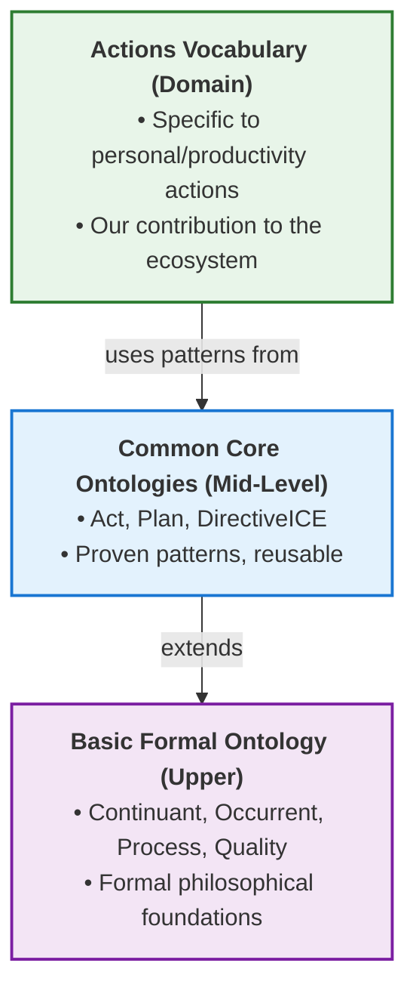
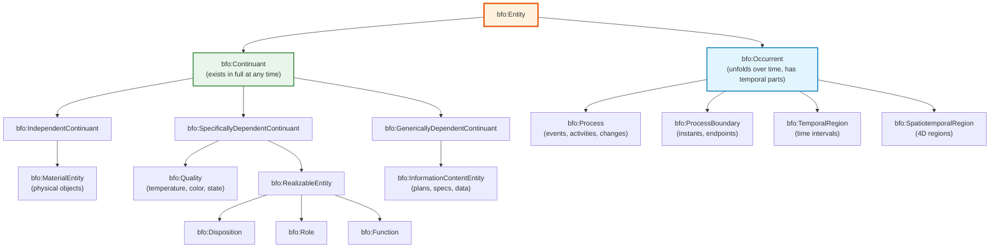
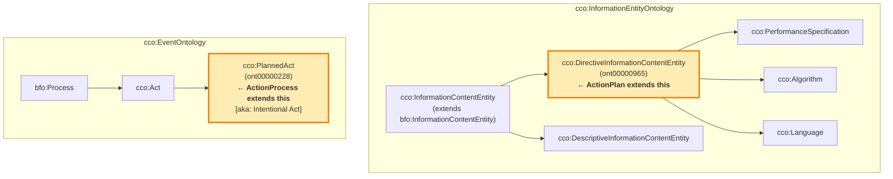
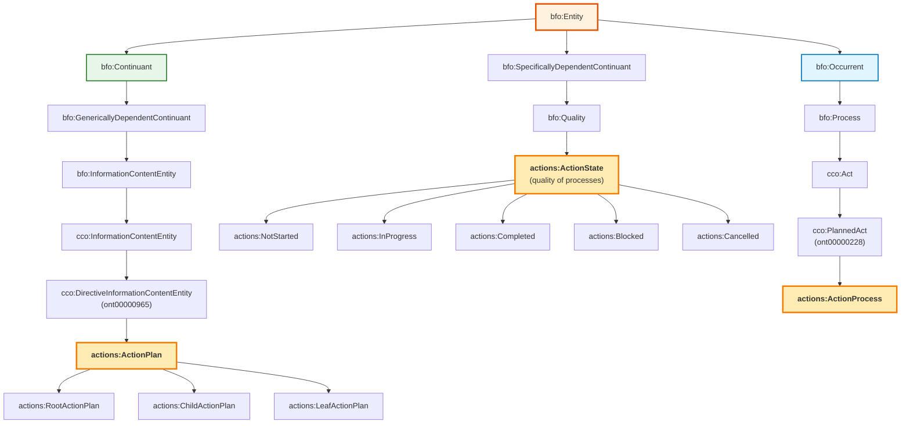

# BFO/CCO Alignment Guide

## Table of Contents
1. [Introduction](#introduction)
2. [BFO Hierarchy](#bfo-hierarchy)
3. [CCO Extensions](#cco-extensions)
4. [Actions Vocabulary Mapping](#actions-vocabulary-mapping)
5. [Design Patterns](#design-patterns)
6. [Reasoning Implications](#reasoning-implications)

---

## Introduction

This guide explains how the Actions Vocabulary v3 aligns with Basic Formal Ontology (BFO) and Common Core Ontologies (CCO), providing the rationale for design decisions and patterns.

### Why BFO?

**BFO (Basic Formal Ontology)** is:
- ISO/IEC 21838-2:2021 standard for upper ontologies
- Used by 450+ ontology projects worldwide
- Provides formal philosophical grounding for scientific ontologies
- Enables interoperability across domains (biomedical, defense, industry)

### Why CCO?

**CCO (Common Core Ontologies)** is:
- Mid-level ontology extending BFO for practical domains
- Baseline standard for DoD and Intelligence Community ontology work
- Provides reusable patterns for common concepts (plans, acts, agents, information)
- Well-maintained and actively developed

### Why Both?



---

## BFO Hierarchy

### Core BFO Structure



### Key BFO Distinctions

#### 1. Continuant vs Occurrent

**Continuants persist through time:**
- A plan exists continuously from creation to deletion
- You can point to "this plan" at any moment
- Properties remain relatively stable

**Occurrents unfold over time:**
- A process has beginning, middle, end
- You can't point to the "whole process" at one instant
- Has temporal parts (phases, stages)

#### 2. Independent vs Dependent

**Independent Continuants:**
- Can exist on their own (a person, a computer)

**Specifically Dependent Continuants:**
- Depend on particular bearer (John's temperature, this process's state)

**Generically Dependent Continuants:**
- Can have multiple bearers (a plan can be copied, stored in multiple places)
- Information entities fall here

---

## CCO Extensions

### CCO Modules We Use



**Note:** CCO does not define a `Plan` class. Plans are represented as specialized `DirectiveInformationContentEntity` subclasses in domain ontologies.

### CCO Classes We Extend

#### cco:DirectiveInformationContentEntity (ont00000965)

**CCO URI:** `https://www.commoncoreontologies.org/ont00000965`

**Definition:** An information content entity that consists of a set of propositions or images (as in the case of a blueprint) that prescribe some Entity.

**Key Features:**
- Prescribes other entities (via `cco:prescribes` relation - ont00001942)
- Information entity (can be copied, stored, transmitted)
- Generic class - requires domain specialization

**Why ActionPlan extends DirectiveInformationContentEntity:**
```turtle
actions:ActionPlan rdfs:subClassOf cco:ont00000965 .
```
- Semantically correct - action plans ARE directive information
- Follows CCO best practice (specialize directives in domain ontologies)
- Inherits CCO's prescriptive pattern
- Minimal dependencies - no intermediate abstractions

#### cco:PlannedAct (ont00000228)

**CCO URI:** `https://www.commoncoreontologies.org/ont00000228`

**Alternative Label:** Intentional Act

**Definition:** An Act in which at least one Agent plays a causative role and which is prescribed by some Directive Information Content Entity held by at least one of the Agents.

**Key Features:**
- Is a BFO Process (unfolds over time)
- Performed by agents (for future extension)
- Prescribed by directive ICE (like our ActionPlan)

**Why ActionProcess extends PlannedAct:**
```turtle
actions:ActionProcess rdfs:subClassOf cco:ont00000228 .
```
- Perfect semantic fit - our processes ARE planned acts
- Links to agents (when we add them)
- Prescribed by ActionPlans (DirectiveICE)
- Standard CCO pattern for intentional actions

---

## Actions Vocabulary Mapping

### Complete Class Hierarchy



**Key Points:**
- ActionPlan directly extends CCO's DirectiveInformationContentEntity
- ActionProcess directly extends CCO's PlannedAct (aka IntentionalAct)
- No intermediate "Plan" class - CCO expects domain specialization
- Flat hierarchy - only specialize when needed (Root/Child/Leaf)

### Property Alignments

#### Object Properties

```turtle
# From CCO
cco:prescribes (ont00001942)
    rdfs:domain cco:DirectiveInformationContentEntity ;
    rdfs:range bfo:Entity .
    # "x prescribes y iff x is an instance of Information Content Entity
    # and y is an instance of Entity, such that x serves as a rule or
    # guide for y if y an Occurrent, or x serves as a model for y if
    # y is a Continuant."

# Our specialization (with domain/range restrictions)
actions:prescribes rdfs:subPropertyOf cco:ont00001942 ;
    rdfs:domain actions:ActionPlan ;
    rdfs:range actions:ActionProcess .

# Our additions
actions:hasState
    rdfs:domain actions:ActionProcess ;
    rdfs:range actions:ActionState .
```

#### Datatype Properties

```turtle
# Ours with Schema.org alignment
actions:hasPriority
    rdfs:domain actions:ActionPlan ;
    rdfs:range xsd:positiveInteger .

actions:hasContext
    rdfs:domain actions:ActionPlan ;
    rdfs:range xsd:string ;
    rdfs:subPropertyOf schema:location .

actions:hasDoDate
    rdfs:domain actions:ActionPlan ;
    rdfs:range xsd:date ;
    rdfs:subPropertyOf schema:startTime .
```

---

## Design Patterns

### Pattern 1: Plan-Process Separation

**BFO Foundation:**
- Plans are `bfo:InformationContentEntity` (continuants)
- Processes are `bfo:Process` (occurrents)
- Clear ontological distinction

**Implementation:**
```turtle
# PLAN - Information about what to do
:weekly_standup_plan a actions:RootActionPlan ;
    schema:name "Weekly team standup" ;
    actions:hasPriority 2 ;
    actions:hasContext "@office" ;
    actions:prescribes :standup_2025_01_20, :standup_2025_01_27 .

# PROCESS 1 - First execution
:standup_2025_01_20 a actions:ActionProcess ;
    bfo:occurs_at :temporal_region_jan20 ;
    actions:hasState actions:Completed .

# PROCESS 2 - Second execution
:standup_2025_01_27 a actions:ActionProcess ;
    bfo:occurs_at :temporal_region_jan27 ;
    actions:hasState actions:InProgress .
```

**Benefits:**
- One plan prescribes multiple executions (recurring actions)
- Execution can fail while plan remains valid
- Reality vs intention explicitly modeled

### Pattern 2: State as Process Quality

**BFO Foundation:**
- `bfo:Quality` inheres in continuants OR processes
- Process qualities describe current phase

**Implementation:**
```turtle
actions:ActionState rdfs:subClassOf bfo:Quality .

actions:hasState
    rdfs:domain actions:ActionProcess ;  # state describes the process
    rdfs:range actions:ActionState .
```

**Why NOT on ActionPlan:**
- Plans don't have states - they don't change
- Processes have states - they progress through phases
- Aligns with BFO: qualities inhere in their bearers

### Pattern 3: Hierarchical Decomposition

**BFO Foundation:**
- `bfo:has_part` - mereological part-whole relation
- Works for both continuants and occurrents

**Implementation:**
```turtle
:root_plan a actions:RootActionPlan ;
    schema:name "Launch product" ;
    bfo:has_part :specs_plan, :docs_plan .

:specs_plan a actions:ChildActionPlan ;
    schema:name "Finalize specifications" ;
    bfo:BFO_0000178 :root_plan .  # part_of (inverse)
```

**Note:** BFO uses numeric IRIs like `BFO_0000178` for relations.

### Pattern 4: SKOS Cross-Ontology Mapping

**Why Not Multiple Inheritance:**
```turtle
# ❌ DON'T DO THIS
actions:ActionPlan rdfs:subClassOf cco:ont00000965, schema:Action .
```
- Mixes two different upper ontologies (BFO and Schema.org)
- Can confuse reasoners

**Correct Approach:**
```turtle
# ✅ DO THIS
actions:ActionPlan rdfs:subClassOf cco:ont00000965 .    # BFO hierarchy (DirectiveICE)
actions:ActionPlan skos:closeMatch schema:Action .      # Cross-ontology mapping
```
- Clean BFO hierarchy
- Machine-readable Schema.org alignment
- See [SCHEMA_ORG_ALIGNMENT.md](./SCHEMA_ORG_ALIGNMENT.md)

---

## Reasoning Implications

### What Reasoners Can Infer

#### 1. Transitive Class Membership

```turtle
:my_plan a actions:RootActionPlan .
```

**Reasoner infers:**
```turtle
:my_plan a actions:ActionPlan .                          # direct parent
:my_plan a cco:DirectiveInformationContentEntity .       # grandparent (ont00000965)
:my_plan a cco:InformationContentEntity .
:my_plan a bfo:InformationContentEntity .
:my_plan a bfo:GenericallyDependentContinuant .
:my_plan a bfo:Continuant .
:my_plan a bfo:Entity .
```

#### 2. Property Domain Inference

```turtle
:my_process actions:hasState actions:Completed .
```

**Reasoner infers:**
```turtle
:my_process a actions:ActionProcess .  # from domain constraint
```

#### 3. Disjointness Violations

```turtle
:bad_action a actions:RootActionPlan, actions:ChildActionPlan .
```

**Reasoner detects:**
- Inconsistency! These classes are declared `owl:disjointWith`
- Helps catch modeling errors

### Consistency Checks

Our ontology has been validated with **HermiT reasoner** and confirmed:
- ✅ Satisfiable (no contradictions)
- ✅ Disjoint classes properly separated
- ✅ Domain/range constraints correct
- ✅ No orphaned classes

---

## Best Practices

### DO:
✅ Keep plan properties on ActionPlan
✅ Keep execution properties on ActionProcess
✅ Use BFO relations where they exist (`has_part`, `occurs_at`)
✅ Document alignment decisions
✅ Run reasoner frequently

### DON'T:
❌ Mix Schema.org and BFO in class hierarchy
❌ Put state on ActionPlan (state belongs to process)
❌ Create custom relations when BFO/CCO provides them
❌ Skip reasoning validation

---

## References

### Official Specifications
- **BFO 2.0**: http://purl.obolibrary.org/obo/bfo.owl
- **BFO Documentation**: https://basic-formal-ontology.org/
- **CCO Repository**: https://github.com/CommonCoreOntology/CommonCoreOntologies
- **ISO Standard**: ISO/IEC 21838-2:2021

### Key Papers
- Smith, B. (2016). "Basic Formal Ontology 2.0: Specification and User's Guide"
- Cox, A. et al. (2021). "An Overview of the Common Core Ontologies"

### Community Resources
- BFO Discussion Group: https://groups.google.com/g/bfo-discuss
- OBO Foundry: http://obofoundry.org/
- NCOR (National Center for Ontological Research): https://ontology.buffalo.edu/

---

## Appendix: BFO Relation Reference

Key BFO relations used in Actions Vocabulary:

| Relation | IRI | Domain | Range | Description |
|----------|-----|--------|-------|-------------|
| has_part | BFO_0000051 | Entity | Entity | Mereological part-whole |
| part_of | BFO_0000050 | Entity | Entity | Inverse of has_part |
| occurs_at | BFO_0000066 | Process | TemporalRegion | When process happens |
| inheres_in | BFO_0000082 | Quality | Entity | Quality bearer |
| prescribes | (CCO) | DirectiveICE | Process | ICE prescribes process |

Full relation catalog: http://purl.obolibrary.org/obo/bfo/2020/bfo.owl
